+++
title = "Wiring Ethernet Throughout the House Using Old Phone Wiring"
tags = ["Hardware", "Networking", "DIY"]
date = 2025-02-09
+++

It's been a while since I did this, but I wired up my parents' house with Ethernet using the old phone wiring. Since it was difficult to find much information on this, I thought I would share my experience as a kind of guide.

Due to the house being big and the router being in the basement, I struggled with the WiFi connection for a long time before this. I tried using a repeater, but while the speed was okay, the connection was not reliable. I also tried using Ethernet over Powerline, but the speed was terrible, and there were issues with a radio clock. You could pretty much break the connection by plugging in a device in the wrong socket. With no cable canals in the walls, it would have been difficult to install new cables in the walls. So I decided to try and use the old phone wiring in the house to connect my devices.

In two places, there were single 4-wire cables, one of which I was luckily able to replace. The rest of the cables are 2 pairs of 4 wires, which I had to use as is. Four wires are enough for Fast-Ethernet. For Gigabit-Ethernet, you need all 8 wires. If you only have 2 wires, you are out of luck and need to use G.fast modems to get a connection.

Before we start, I would like to link this post, which I found very helpful and am going to take the wiring diagrams from:
[Ethernet über Netzwerk- und Telefonkabel: Praktische Montage und Fehlersuche](https://ngb.to/threads/ethernet-%C3%BCber-netzwerk-und-telefonkabel-praktische-montage-und-fehlersuche.39749/) (German)

## Tools and Materials

- Network tool kit
  - Punch-down tool (may not be necessary, depending on the sockets you use)
  - Cable locator (or alternative)
  - Crimping tool (not necessary, depending on the connectors you use)
  - Network cable tester
- Network switch(es) (depending on how your cables are installed)
- RJ-45 Ethernet sockets (one per end of each cable)
- Ethernet cables

## Step 1: Find, Identify, and Map the Cables

First, you need to find all the phone outlets to determine where the cables are and how they are connected. The cables need to have at least 4 wires to be usable for Fast-Ethernet. If you have 8 wires, you can use them for Gigabit-Ethernet.

A cable locator comes in handy here. The network tool kit I bought came with one, but you can also use another method like a battery and an LED.

In my case, there was a place in the ceiling where multiple cables came together. I had to extend the cables and put a network switch there.

## Step 2: Replace the Sockets

Remove the old phone sockets and replace them with RJ-45 sockets. You should have no problems inserting the cables into the sockets using your punch-down tool.

---

**Normal Network Cables:**

**Gigabit-Ethernet:**

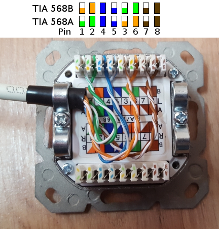

You can also wire up two sockets at a time for Fast-Ethernet like this:  
**Fast-Ethernet:**

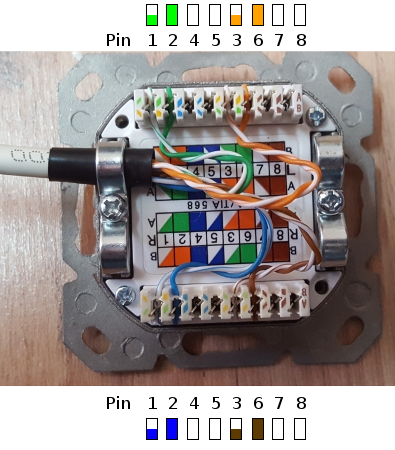

---

**Old ISDN Cables:**

**Gigabit-Ethernet:**

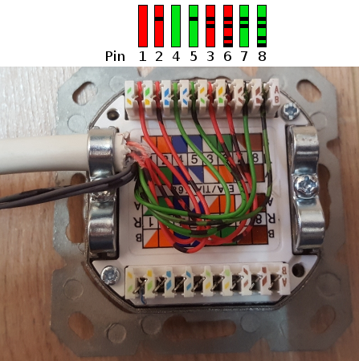

**Fast-Ethernet:**

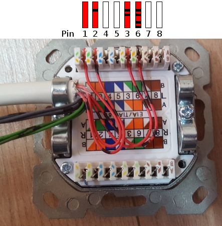

---

**Electricians Cable:**

This cable is not ideal but works as long as the cables are not too long. When removing the insulation, be careful not to confuse which white cable goes with which colored cable. I had a couple of cables like this.

**Gigabit-Ethernet:**

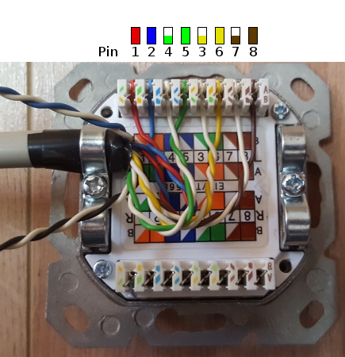

**Fast-Ethernet:**

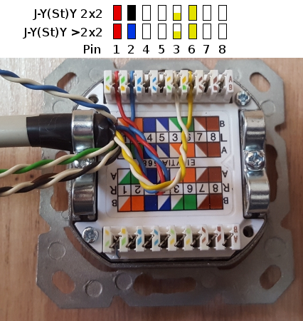

---

Make sure to test the connections with a network cable tester after installing the sockets.

## Step 3: Connect Router and Switch(es)

Now you can connect your cables to the router and switch(es) as needed, test the connections, and hopefully enjoy your new fast and reliable network connection.

---

If you want to read more about the theory behind this, you can check out this page by the Electronic Emergency Service Nuremberg: [Wellenwiderstand (Impedanz) von Telefon-Doppeladern](http://bedienungsanleitung.elektronotdienst-nuernberg.de/impedanz.html) (German)

---

## Pictures




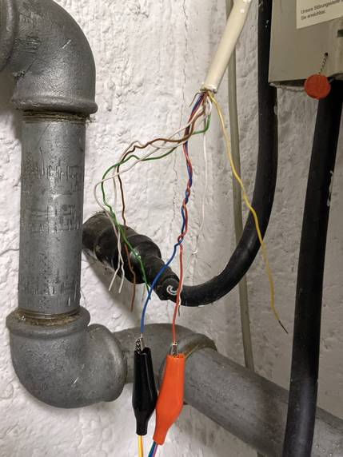
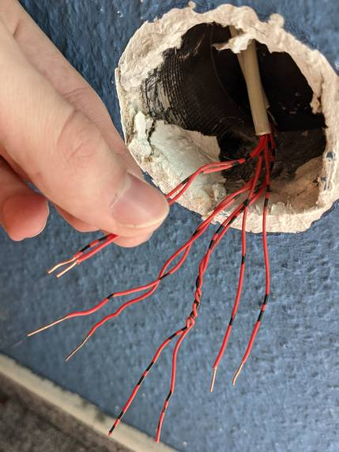
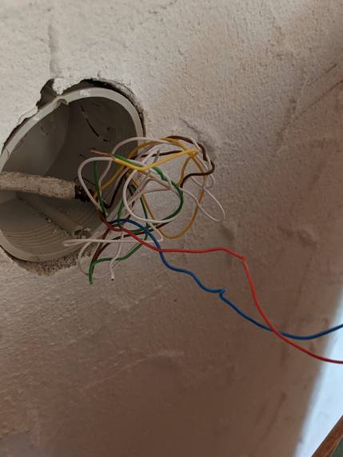
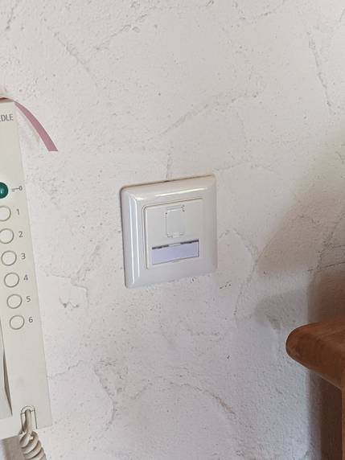
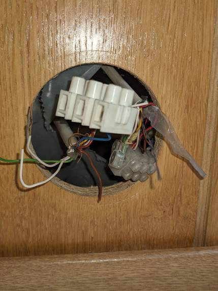
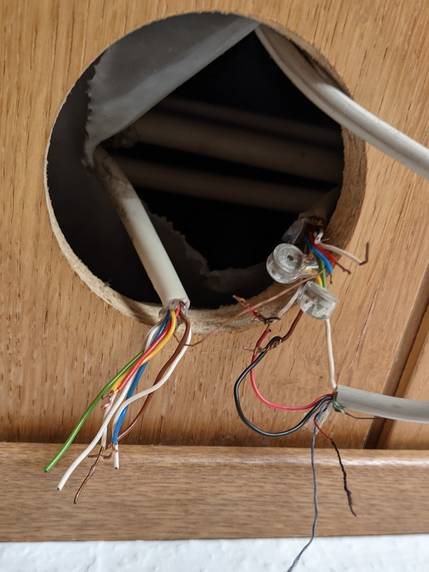
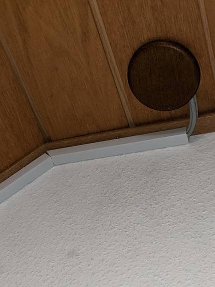
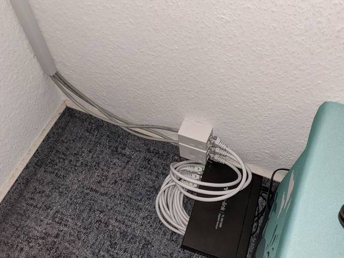
