+++
title = "meishi 名刺"
description = "My business card, as well as a QMK powered macro keyboard."
url = "/meishi"
tags = [
  "Keyboards"
]
date = 2023-08-23
+++

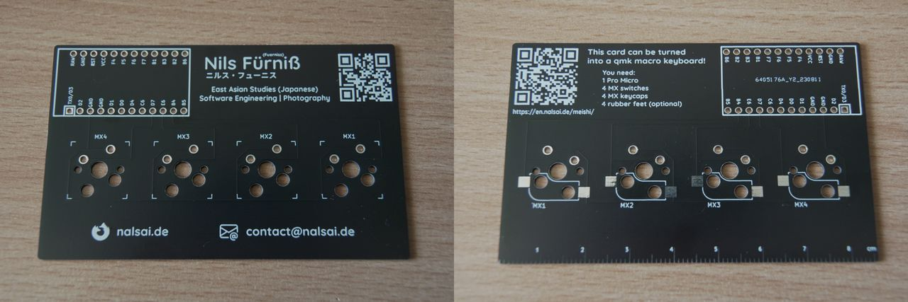

---

You can find the KiCad files at <https://github.com/nalsai/meishi>.

---

## Assembly

### Parts Needed

- 1 _meishi_ PCB
- 1 Pro Micro (with headers)
- 4 MX switches <span class="text-muted">(I used Gateron Milky Yellow Pro)
- 4 MX keycaps <span class="text-muted">(I prefer DSA profile but any profile will work</span><a href="#" data-bs-toggle="tooltip" data-bs-title="as long as they are from the same row (except for cherry profile on upside down switches)" class="text">*</a><span class="text-muted">)
- 4 rubber feet <span class="text-muted">(optional but highly recommended)
- 4 kailh hotswap sockets <span class="text-muted">(optional)

### Soldering The Headers To The Pro Micro

Some Pro Micros come with pre-soldered headers, in which case this step is not needed.

(You can use the PCB to help keep the headers straight.)

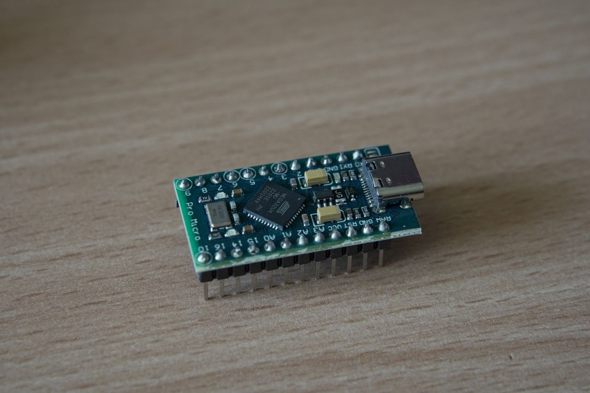

### Soldering The Pro Micro To The PCB

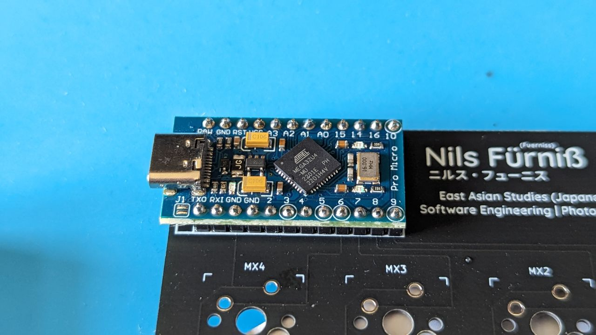

Soldering only the pins shown in the image below is enough. (The pins are B5, B4, E6, D7, GND and the pins at the edges to hold the Pro Micro in place.)

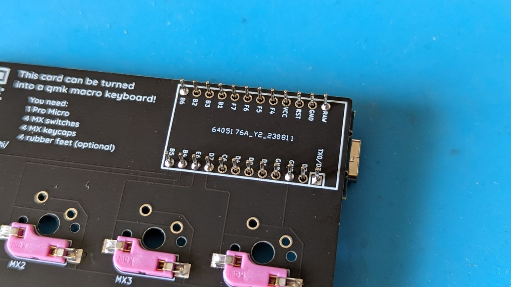

### Soldering The Switches / Hotswap Sockets

<ul class="nav nav-tabs" id="myTab" role="tablist">
  <li class="nav-item" role="presentation">
    <button class="nav-link active" id="no-hotswap" data-bs-toggle="tab" data-bs-target="#no-hotswap-pane" type="button" role="tab" aria-controls="no-hotswap-pane" aria-selected="true">Without hotswap sockets</button>
  </li>
  <li class="nav-item" role="presentation">
    <button class="nav-link" id="hotswap" data-bs-toggle="tab" data-bs-target="#hotswap-pane" type="button" role="tab" aria-controls="hotswap-pane" aria-selected="false">With hotswap sockets</button>
  </li>
</ul>
<div class="tab-content" id="myTabContent">
  <div class="tab-pane show active" id="no-hotswap-pane" role="tabpanel" aria-labelledby="no-hotswap" tabindex="0">
    <p>
    Just put the switches in the holes and solder them from the bottom. (The pins should go through the smaller holes with the silver rings around them, not the large ones, those are for the optional hotswap sockets.)
    </p>
    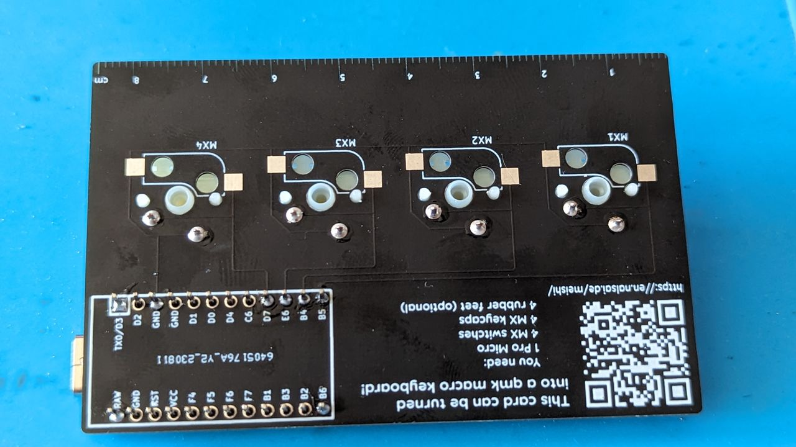
  </div>
  <div class="tab-pane" id="hotswap-pane" role="tabpanel" aria-labelledby="hotswap" tabindex="0">
      Rotate the board and solder the hotswap sockets to the PCB from the bottom. (I put some solder on the pads first and then put the hotswap sockets on top and used my soldering iron to melt the solder again and attach the hotswap sockets.)<br>
      Then you can rotate the board back and insert the switches. (Be careful not to insert the pins into the sockets and not bend them.)
      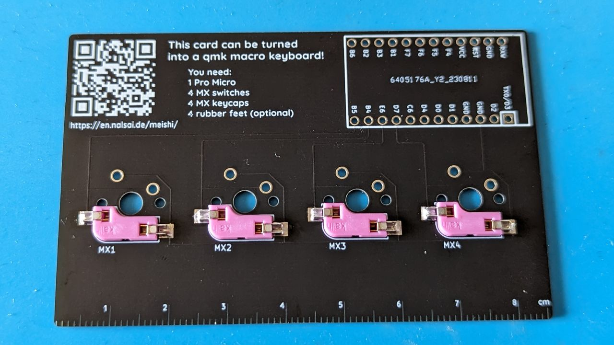
  </div>
</div>

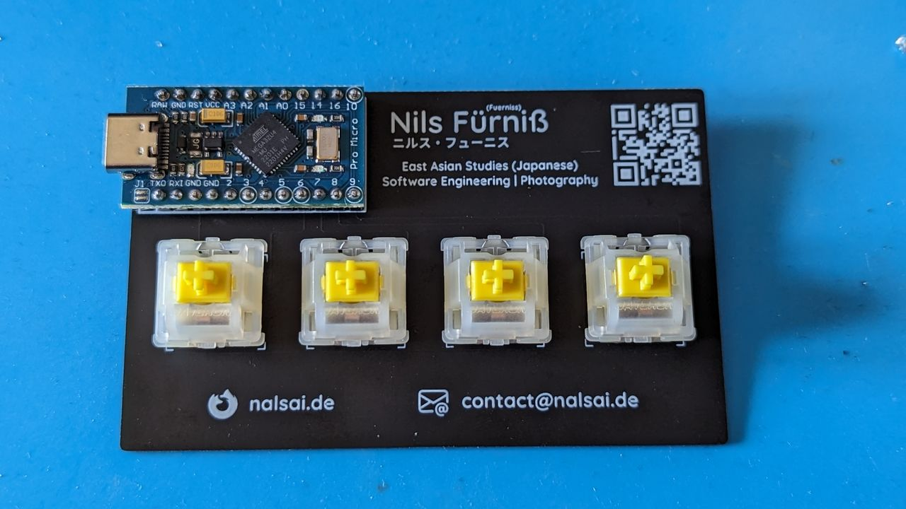

### Keycaps

Just put the keycaps on the switches and press them down.

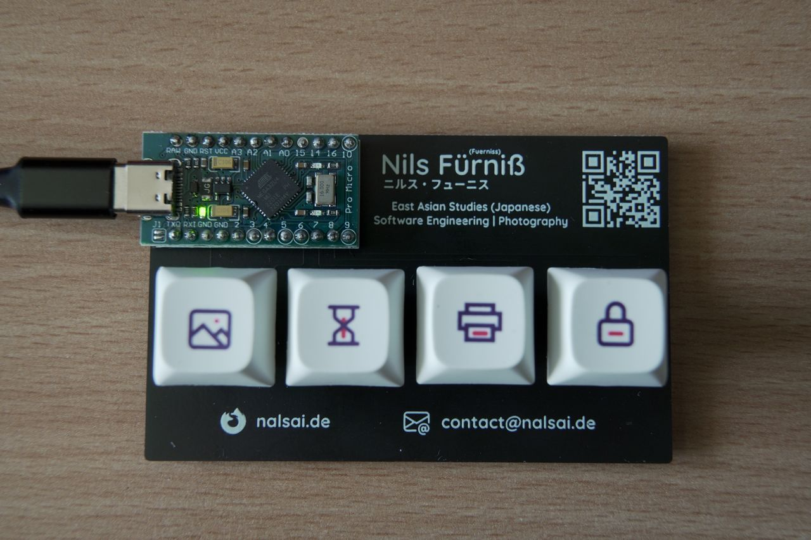

---

<h2 id="firmware" class="id-scroll-fix">Firmware</h2>

Follow the [QMK Tutorial](https://docs.qmk.fm/#/newbs) for an in depth guide.

If you just want to flash pre-compiled firmware, jump to [Flashing Your Pro Micro](#flashing-your-pro-micro) and follow the GUI instructions.

---

### Compiling

<ul class="nav nav-tabs" id="myTab" role="tablist">
  <li class="nav-item" role="presentation">
    <button class="nav-link active" id="linux" data-bs-toggle="tab" data-bs-target="#linux-pane" type="button" role="tab" aria-controls="linux-pane" aria-selected="true">Linux</button>
  </li>
  <li class="nav-item" role="presentation">
    <button class="nav-link" id="windows" data-bs-toggle="tab" data-bs-target="#windows-pane" type="button" role="tab" aria-controls="hotswap-pane" aria-selected="false">Windows</button>
  </li>
  <li class="nav-item" role="presentation">
    <button class="nav-link" id="macos" data-bs-toggle="tab" data-bs-target="#macos-pane" type="button" role="tab" aria-controls="hotswap-pane" aria-selected="false">macOS</button>
  </li>
</ul>
<div class="tab-content" id="myTabContent">
  <div class="tab-pane show active" id="linux-pane" role="tabpanel" aria-labelledby="linux" tabindex="0">
    Install the QMK CLI by installing pip and then running the following command:
    <pre tabindex="0"><code>python3 -m pip install --user qmk</code></pre>
    Open your preferred terminal app and run the following command to run QMK Setup:
  </div>
  <div class="tab-pane" id="windows-pane" role="tabpanel" aria-labelledby="windows" tabindex="0">
    Install <a href="https://github.com/qmk/qmk_distro_msys/releases/latest">QMK MSYS</a>.
    Then open it and run the following command to run QMK Setup:
  </div>
  <div class="tab-pane" id="macos-pane" role="tabpanel" aria-labelledby="macos" tabindex="0">
    You will need to install Homebrew. Follow the instructions on <a href="https://brew.sh">https://brew.sh</a>.
    <div class="callout callout-warning"><strong>NOTE:</strong> If you are using Apple Silicon, such as the M1, you will need to install a rosetta compatible version of Homebrew. This version does not override the base Homebrew. This can be done by running <code>arch -x86_64 /bin/bash -c "$(curl -fsSL https://raw.githubusercontent.com/Homebrew/install/HEAD/install.sh)"</code>.</div>
    Install the QMK CLI by running:
    <pre tabindex="0"><code>brew install qmk/qmk/qmk</code></pre>
    Install the QMK CLI on an Apple Silicon Mac by running:
    <pre tabindex="0"><code>arch -x86_64 brew install qmk/qmk/qmk</code></pre>
    Open your preferred terminal app and run the following command:
  </div>
</div>

```
qmk setup nalsai/qmk_firmware -H ~/Documents/qmk_firmware
```

(Answer y to all of the prompts.)

---

<div class="callout callout-warning"><strong>NOTE:</strong> The Pro Micro uses the Caterina bootloader. If you use an Elite C you need to edit <code>qmk_firmware/keyboards/nalsai/meishi/info.json</code> and change <code>development_board</code>  from promicro to <code>elite_c</code> .</div>

Compile the firmware with the via keymap.
```
qmk compile -kb nalsai/meishi -km via
```

---

<h3 id="flashing-your-pro-micro" class="id-scroll-fix">Flashing Your Pro Micro</h3>

If you want to download pre-compiled firmware, it is available at <https://github.com/nalsai/qmk_firmware/releases/latest>.  
Just click on `nalsai_meishi_via.hex` to download it.

<ul class="nav nav-tabs mt-4" id="myTab" role="tablist">
  <li class="nav-item" role="presentation">
    <button class="nav-link active" id="terminal" data-bs-toggle="tab" data-bs-target="#terminal-pane" type="button" role="tab" aria-controls="linux-pane" aria-selected="true">command line</button>
  </li>
  <li class="nav-item" role="presentation">
    <button class="nav-link" id="gui" data-bs-toggle="tab" data-bs-target="#gui-pane" type="button" role="tab" aria-controls="hotswap-pane" aria-selected="false">GUI (Windows & macOS only)</button>
  </li>
</ul>
<div class="tab-content" id="myTabContent">
  <div class="tab-pane show active" id="terminal-pane" role="tabpanel" aria-labelledby="terminal" tabindex="0">
    <p>
      Run the following command to flash your keyboard:
      <pre tabindex="0"><code>qmk flash -kb nalsai/meishi -km via</code></pre>
      Now, put the pro micro into DFU (bootloader) mode by shorting the pins on the PCB labeled RESET and GND together.
    </p>
    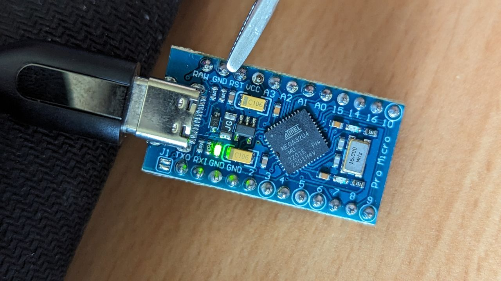
    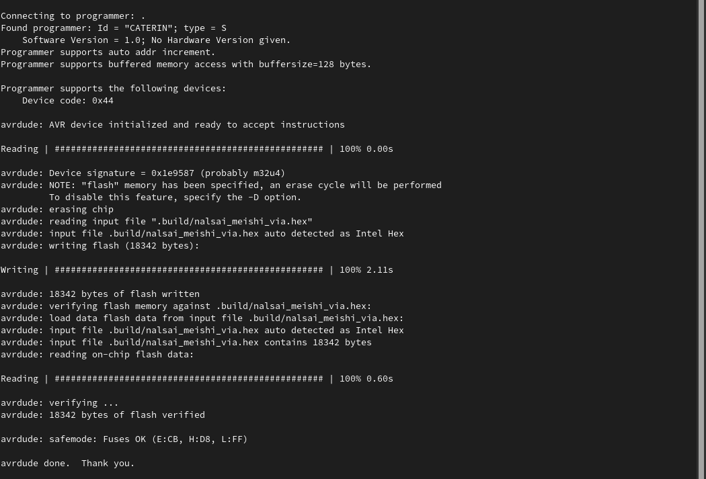
  </div>
  <div class="tab-pane" id="gui-pane" role="tabpanel" aria-labelledby="gui" tabindex="0">
    <p>
      The simplest way to flash your keyboard is with <a href="https://github.com/qmk/qmk_toolbox/releases/latest">QMK Toolbox</a>.<br>
      Run QMK Toolbox (allow it to install drivers when prompted) and select the firmware file.
    </p>
    <p>
      Now, plug in your Pro Micro and locate the RST and GND pins.<br>
      Briefly connect these two contacts using something like metal tweezers, a screwdriver, a paperclip or a loose piece of wire.<br>
    </p>
    
    You should see a message in yellow, similar to this in QMK Toolbox:
    <code class="text-warning d-block">*** DFU device connected: Atmel Corp. ATmega32U4 (03EB:2FF4:0000)</code>
    Now, you just need to click the flash button.
  </div>
</div>

### You're Done!

Congrats! Your custom firmware has been programmed to your Pro Micro.

---

## <svg style="height: 1em" role="img" aria-labelledby="via-svg-alt" xmlns="http://www.w3.org/2000/svg" viewBox="0 0 525.74 320" style="padding:20px;width:300px" color="rgba(242,242,242,1)"><defs><style>.cls-1{fill:currentColor}</style></defs><title id="via-svg-alt">Via</title><g id="Layer_2" data-name="Layer 2"><g id="Layer_2-2" data-name="Layer 2"><path class="cls-1" d="M524.6 237.33 459.25 37.88C451.73 14.93 432.81.12 411 .12h-.13c-21.87.06-40.79 15-48.21 38.11l-64 199.23a22.93 22.93 0 0 0 43.66 14l18.74-58.35h100.81l19.13 58.5a22.93 22.93 0 0 0 43.58-14.28Zm-145-90a2.78 2.78 0 0 1-2.65-3.63l29.37-91.41C407.82 47.68 410 46 411 46c1 0 3.17 1.68 4.65 6.19l30 91.49a2.78 2.78 0 0 1-2.64 3.64ZM212.25 1.21A22.93 22.93 0 0 0 183.41 16l-64 199.23c-1.47 4.57-3.66 6.28-4.69 6.29-1 0-3.17-1.68-4.64-6.19L44.72 15.91A22.92 22.92 0 1 0 1.15 30.18l65.34 199.45c7.52 23 26.44 37.77 48.22 37.77h.14c21.86-.06 40.78-15 48.2-38.11l64-199.23a22.93 22.93 0 0 0-14.8-28.85ZM306.09 1.1a22.93 22.93 0 0 0-28.84 14.82l-71.5 222.54a22.93 22.93 0 1 0 43.66 14l71.5-222.55A22.93 22.93 0 0 0 306.09 1.1Zm-78.17 255.45a12.5 12.5 0 1 1 12.5-12.5 12.5 12.5 0 0 1-12.5 12.5Zm70.7-220.91a12.5 12.5 0 1 1 12.5-12.5 12.5 12.5 0 0 1-12.5 12.5Z"></path></g></g></svg>

You can use [VIA](https://www.caniusevia.com/) to configure your keyboard with Chrome. (Firefox doesn't support WebUSB 😭.)

Open <https://usevia.app/>. Go to the Settings tab and enable "Show Design Tab". Then go to the [Design tab](https://usevia.app/design) and confirm the warning. Click "Load Draft Definition" and select the `nalsai_meishi.json` file you can download from <https://github.com/nalsai/qmk_firmware/releases/latest>.

If your keyboard is plugged in, Chrome should ask you to allow VIA to connect to your keyboard. Select it and click "Connect". Now you can configure your keyboard on the Configurator tab.

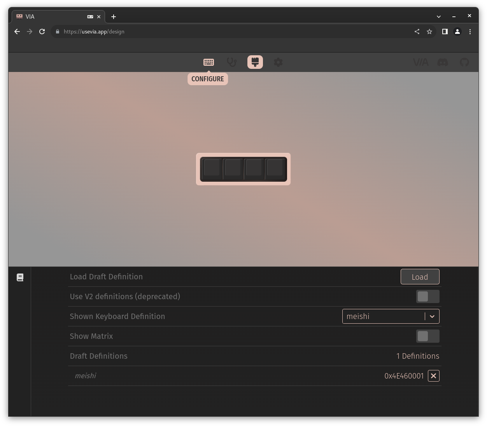

&nbsp;

---

&nbsp;

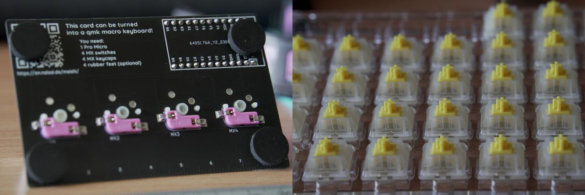


&nbsp;

---

## Thanks for the inspiration

- <https://medium.com/henngeblog/mechanical-keyboard-business-card-83385aa8bc29> (https://github.com/lukas-reineke/meishi)
- <https://github.com/Biacco42/meishi>
- <https://www.youtube.com/watch?v=rEdWV4Augfc>
