+++
title = "Visiting Places from Sanoba Witch (Sabbat of the Witch)"
description = "Kyōto, Ōsaka, and Kōbe locations from the visual novel Sanoba Witch"
tags = [
  "Visual Novel",
  "Anime Tourism",
  "Yuzusoft",
]
date = 2024-05-26
+++

Welcome back to another pilgrimage! This time, I visited places from the Yuzusoft visual novels Senren\*Banka (2016) and Sanoba Witch (2018). Since the two visual novels settings take inspiration from Kyōto, I visited them together. This is the page for Sanoba Witch. You can find the [Senren*Banka Pilgrimage by following this link]().

I recommend getting the bus day ticket and starting early if you want to tour it in one day, especially in winter, as the sun sets quite early. A bicycle could also come in handy to reach some of the places from Sanoba Witch.  

Although I think that the places from Senren\*Banka are more worth visiting, I still enjoyed the pilgrimage for Sanoba Witch.

## Kyōto Station

I don't think Kyōto Station needs an introduction, but here it is anyway:  
It has Japan's second-largest station building (after Nagoya Station) and is one of the country's largest buildings, incorporating a shopping mall, hotel, movie theater, Isetan department store, and several local government facilities under one 15-story roof.  
The building's futuristic design was conceived by Japanese architect Hara Hiroshi. It attempts to convey historical Kyoto through a modern aesthetic.

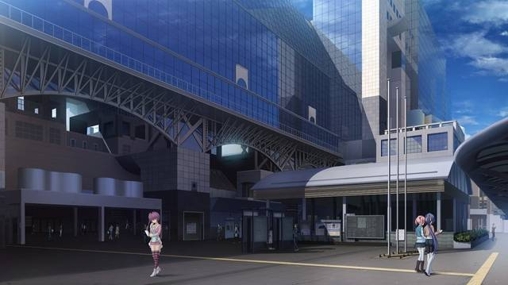
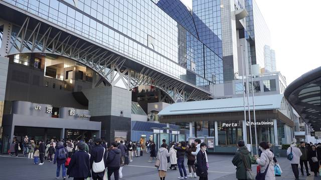

Date: 2023-12-24

## Kyoto Concert Hall

This image is used as the school in the visual novel; however, it is the Kyoto Concert Hall in reality.

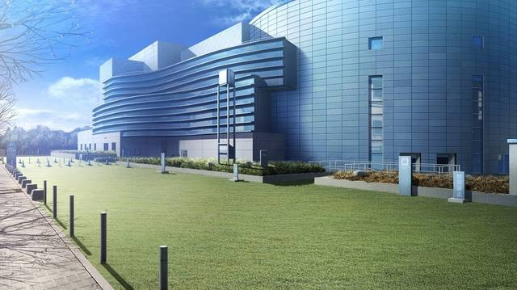
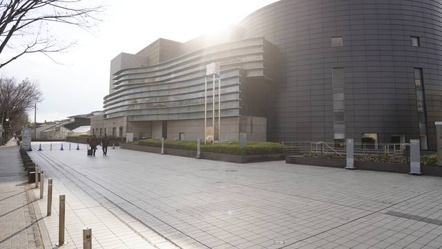

Date: 2023-12-27

## Takaragaike-dōri

Nothing special here. There's a driving school on the other side of the street.

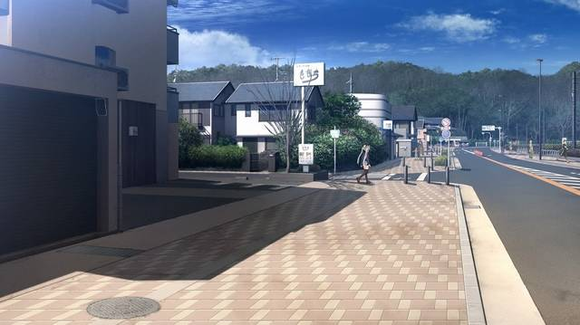
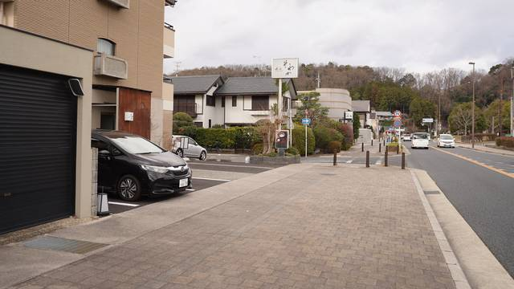

Date: 2023-12-27

## Inuzuka Bridge

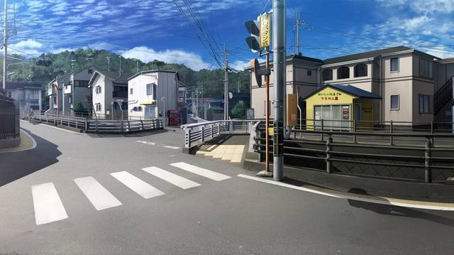
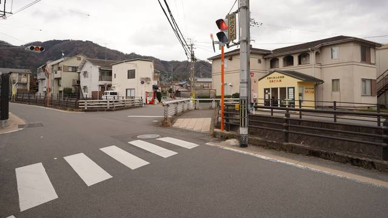

Date: 2023-12-27

## Yamanohana-chō

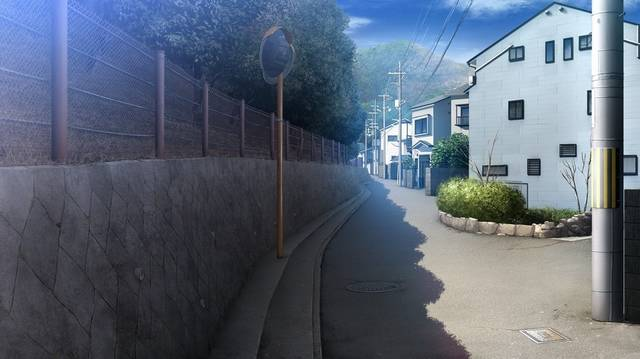
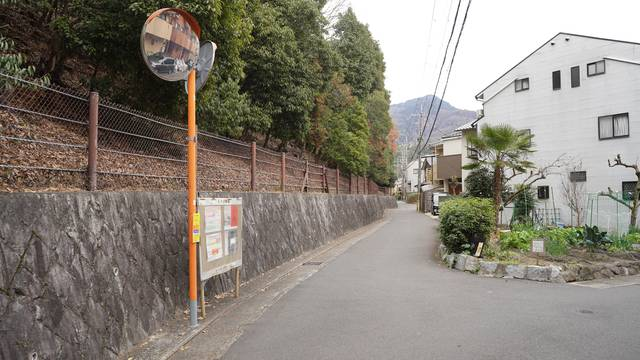

Date: 2023-12-27

## Sir Thomas Lipton - Sanjo Main Shop

At first, I tried finding it by just walking along the shopping street, but it is a much larger street than I expected and I ended up using Google Maps to find it.  
This location is fairly close to Shirakawa Lane from the Senren\*Banka pilgrimage.

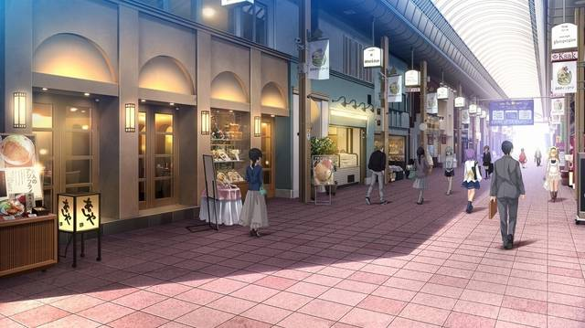
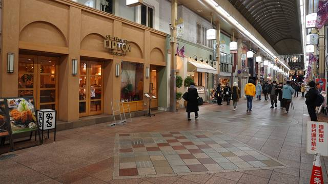

Date: 2023-12-27

This was the last place on my Yuzusoft pilgrimage in Kyoto, so I ended the day by enjoying some Tsukemen (dipping noodles) at Tsurukame nearby, as suggested by gaogaogao on their Hatena Blog.
I had to wait for a long time to get a seat, as it is a very small restaurant but the Tsukemen were delicious.

---

## Grand Front Ōsaka

This is the view of the South Building coming from Ōsaka Station.

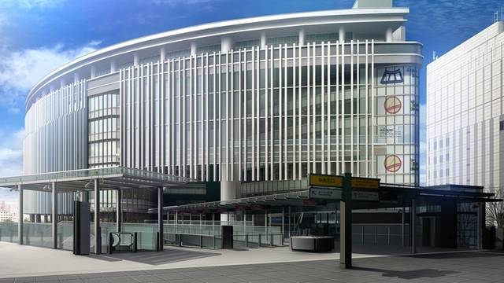
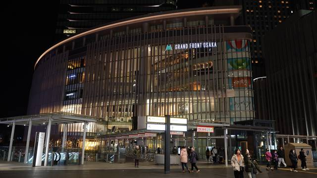

Date: 2023-12-26

You should be able to find it by walking straight from the previous location to the other side of the building. The shop there is "Aux Bacchanales".
I was exhausted and in a hurry to catch the train back to Kyōto, so the perspective is a bit off.

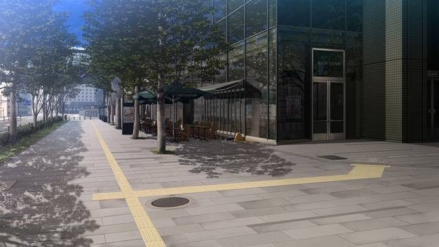
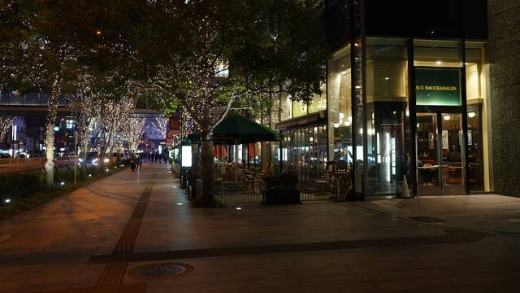

Date: 2023-12-26

Due to circumstances outside my control, I arrived at the Grand Front Ōsaka in the late evening,and everything was already closed, so I had to return another day to take this picture inside the building.
It is inside the North Building on the 4th floor. You can walk through the South Building over the bridge to the North Building and then go up the escalators to get there. The store you can see on the same floor in the picture is "HIDA Ōsakaten".

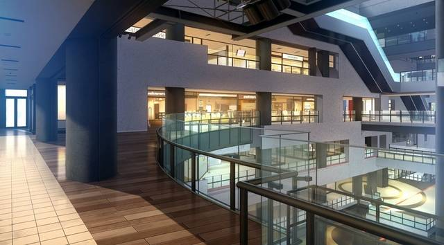
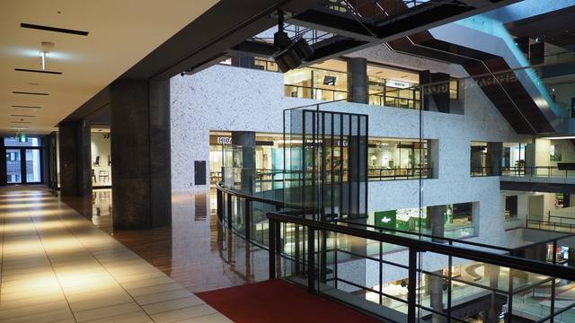

Date: 2024-03-11

---

## Starbucks Coffee - Kōbe Kitano Ijinkan

The Kitano area in Kōbe is famous for its old western style residences. This Starbucks is one of these _Ijinkan_.
The building is called _Kitano Monogatari-kan_ and was apparently built in 1907 for an American resident named M.J. Shay.
Being a Starbucks with a special design in a touristy area, it was somewhat crowded.  
In the visual novel, this places is the coffee shop "Schwarze Katze".

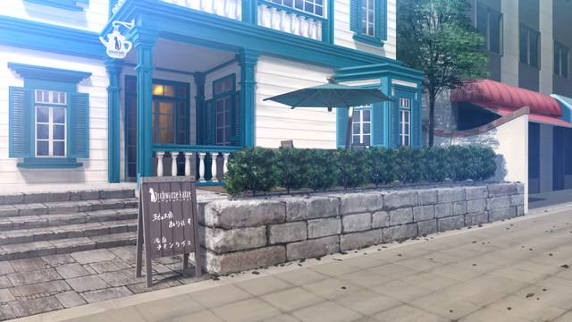
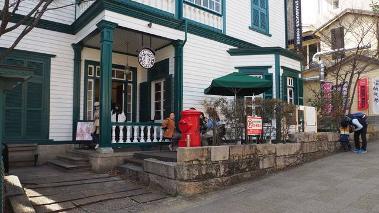

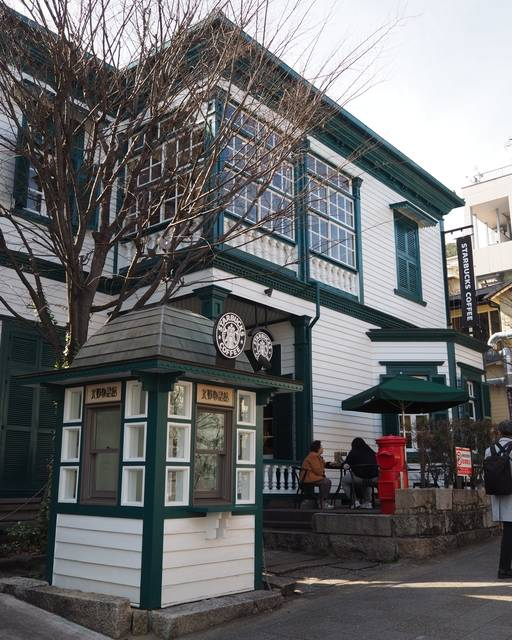

Date: 2024-03-11

---

While Senren\*Banka has a more traditional visual novel and shows more traditional and beautiful places in Kyoto, Sanoba Witch is more modern and I feel like it relies more strongly on your imagination.
The places in the north east of Kyoto weren't that nice compared to the general image of Kyōtō, but I still enjoyed the pilgrimage. I hope you enjoyed it as well!

---

If you haven't already, now is the perfect time to check out the [Senren\*Banka Pilgrimage](). Most of its places I would recommend anyone to visit, regardless of the visual novel.

---

Now that we're at the end, it's time to link others who have also made a similar pilgrimage.  
Special thanks to rinnow, gaogaogao and azusairi.  
Feel free to contact me if you made the pilgrimage too and want to be added to the list.

- <https://rinnow.hatenablog.com/entry/sothewitch>
- <https://gaogaogao.hatenablog.com/entry/2018/09/03/105820>
- <https://azusairi.com/?p=2549>
- <https://azusairi.com/?p=2576>
- <http://seichidiary.blog.fc2.com/blog-entry-40.html>
