+++
title = "Violet Evergarden Gaiden - Cochem Locations in Real Life"
description = ""
tags = [
  "Anime",
  "Anime Tourism"
]
date = 2025-01-14
+++

The location of the movie "Violet Evergarden: Eternity and the Auto Memory Doll" is based on the town of Cochem in Germany.
I visited the town and took pictures of the locations that appear in the movie.

Cochem is easily accessible by train, so it makes for a great trip even without a car. The town is small and you can walk to most of the locations in the movie.
If you come from Koblenz, make sure you sit on the left side of the train to see the Mosel river similar to Violet's journey.

I came from Mannheim using the RE1 without any additional costs, thanks to my student Deutschlandticket. On the way back I went to Koblenz, but I didn't have a window seat, as all window seats on the right side (to see the Mosel) were already taken.

### Pinnerkreuz

I went here first, as there is a hiking trail starting from right next to the train station and I wanted to get there before the sun sets.  
The Pinnerkreuz and the hiking trail offer a nice view of the town and the Mosel river.

During tourist season, you can also take the Cochemer Sesselbahn (chairlift) to get up here but as I visited in winter, it was closed.  
The hiking trail takes about 45 minutes to get up there from the train station and 15 minutes down to the start of the chairlift, close to the city center.



(~00:02:28)

## Hinter Kempeln

The second stop on Taylor's first mail delivery tour is at Hinter Kempeln. The area looks different in real life, but the stairs are the same.

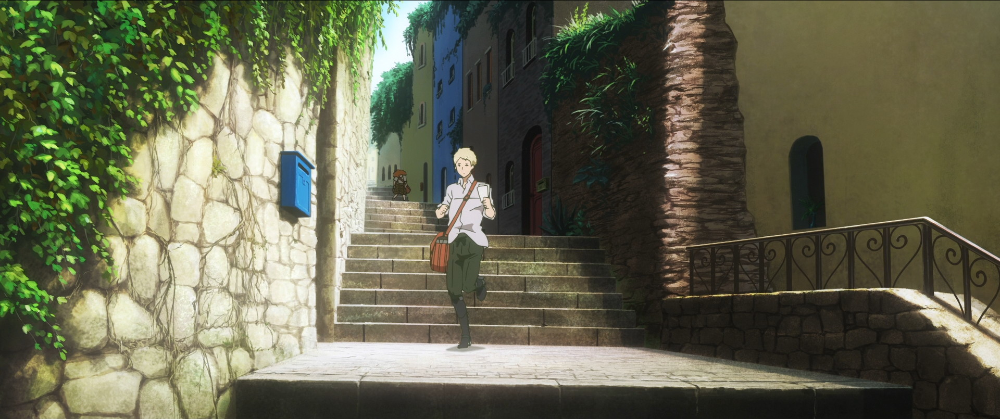

### Obergasse

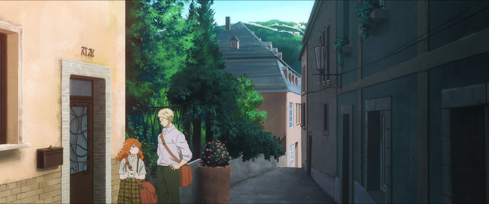

Cochem - Taylors first mail delivery - This stop on Taylors first tour is at Obergasse, next to a hotel called "Lohspeicher". The house looks a bit different in real life and is a private home. So please don't put anything in the actual mailboxes there.
Cochem - Taylors first mail delivery

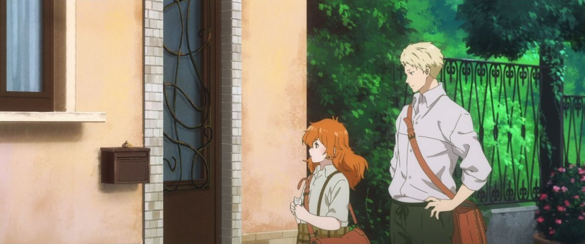

Cochem - Taylors first mail delivery 2

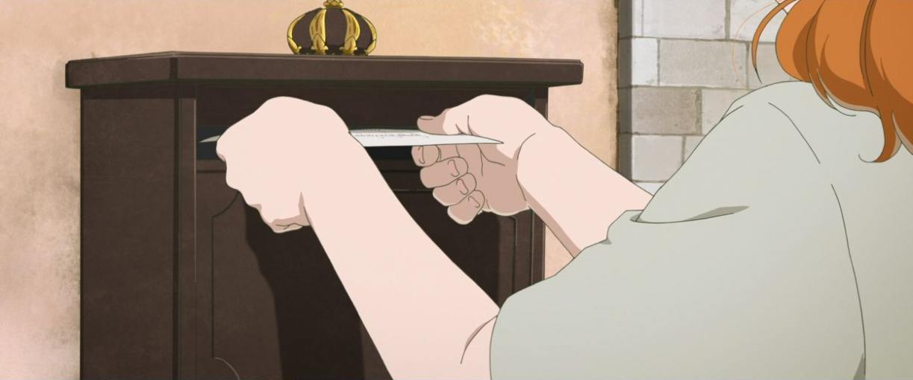

Cochem - Taylors first mail delivery 3 - We found this similar looking mailbox at a nearby plaza, but maybe there are other similar mailboxes in Cochem

### Branntweingässchen

Cochem - Branntweingässchen - The last stop of Benedict's and Taylor's tour is only a few steps away from her first mail delivery in real-life.

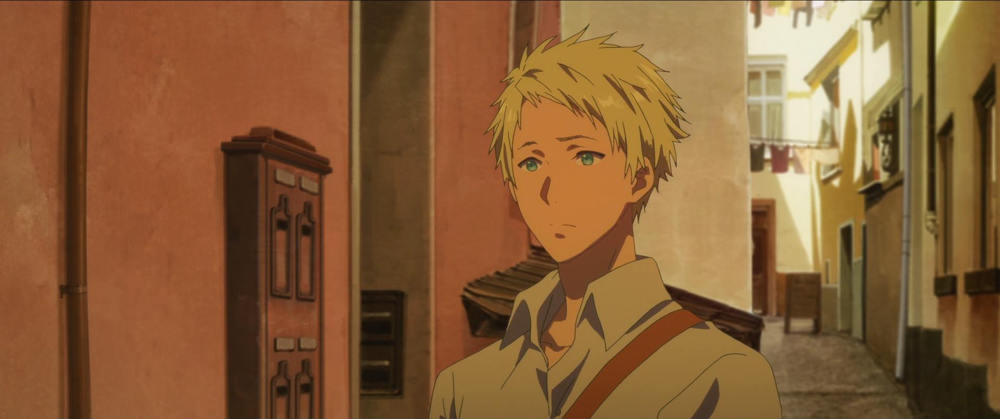
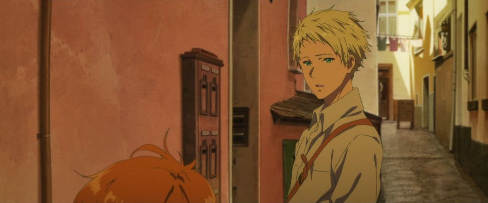
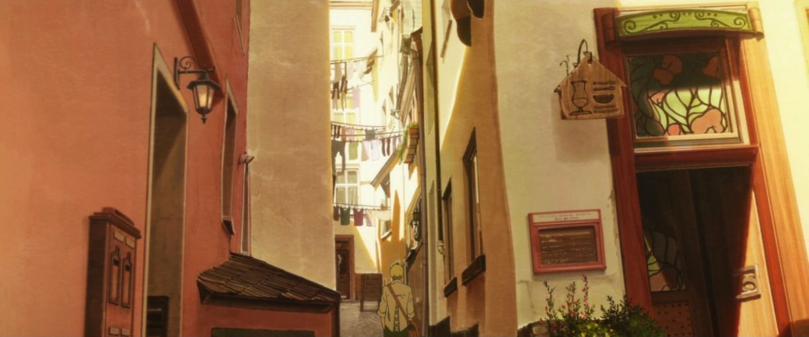

### Alte Gutsschänke

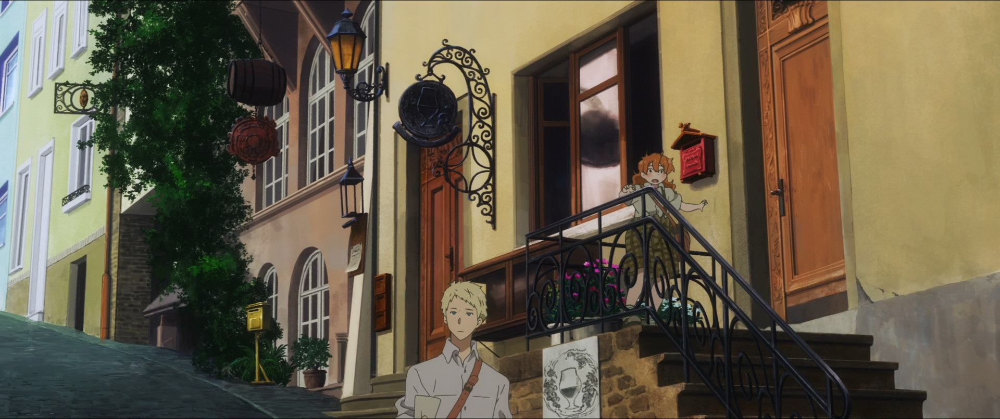

### Castle

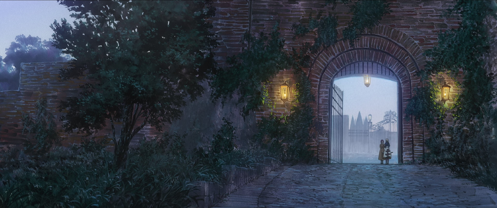

 Cochem Castle - Outer Gate - The Gate matches what is shown in the Animation, but area on the left side is different. Additional cuts: 00:38:40ff

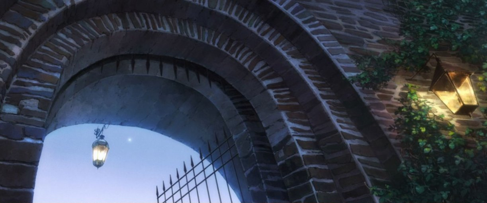

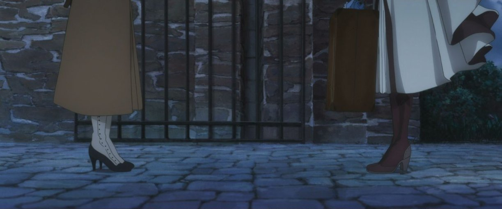

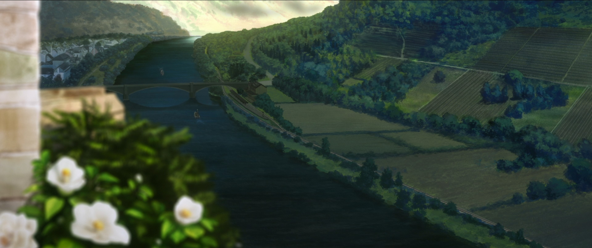

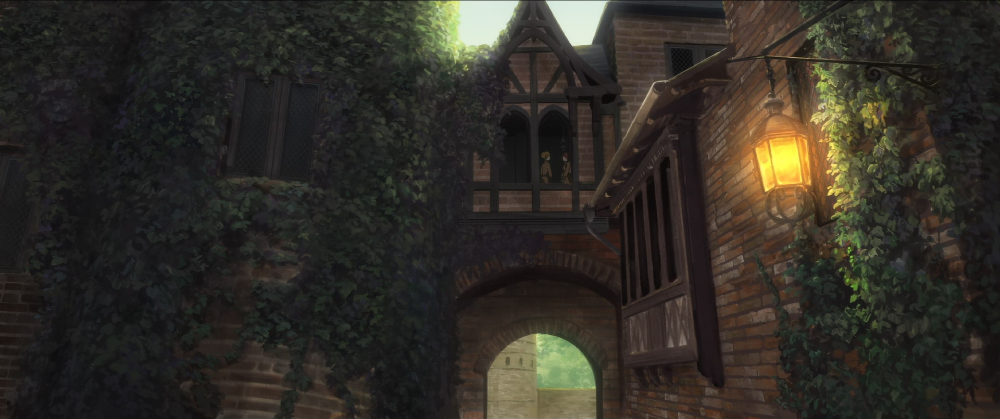

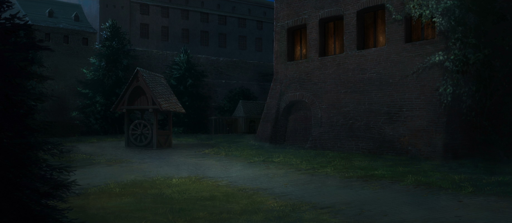

### View from the other side of the river (Uferstraße)

In reality, the train and all other locations are on the other side of the river. You can get this view by crossing the bridge.

The location of this picture is actually right next to where I stayed the night.

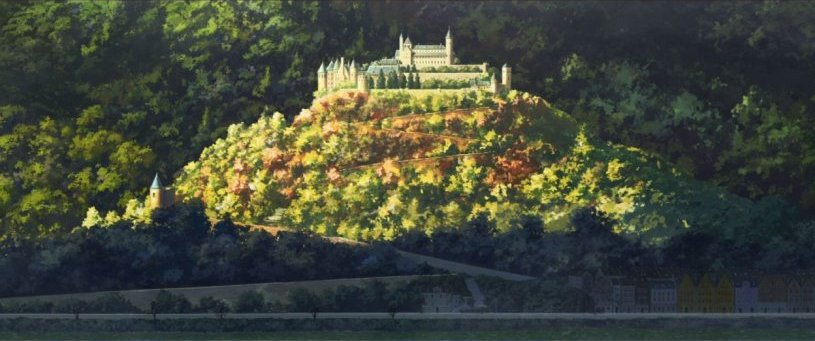

### Hatzenport - St. Johannes

You need a car and drive ~15 minutes to the village of Hatzenport to take this picture, so I didn't go there.
You can see the St. Johannes church above the townscape from the other side of the river.

---

That's all for now. I hope you enjoyed the pictures, and maybe you'll visit Cochem yourself.

I'm planning to also visit the locations of Violet Evergarden in Heidelberg, Mannheim and Nuremberg in the future and write about them here.

Thanks to J-Junk for the information, I found their *dōjinshi* at Comiket 104, which inspired me to make this trip:  
<https://www.j-junk.de/violet-evergarden-gaiden-real-life-locations-in-germany/>
T
