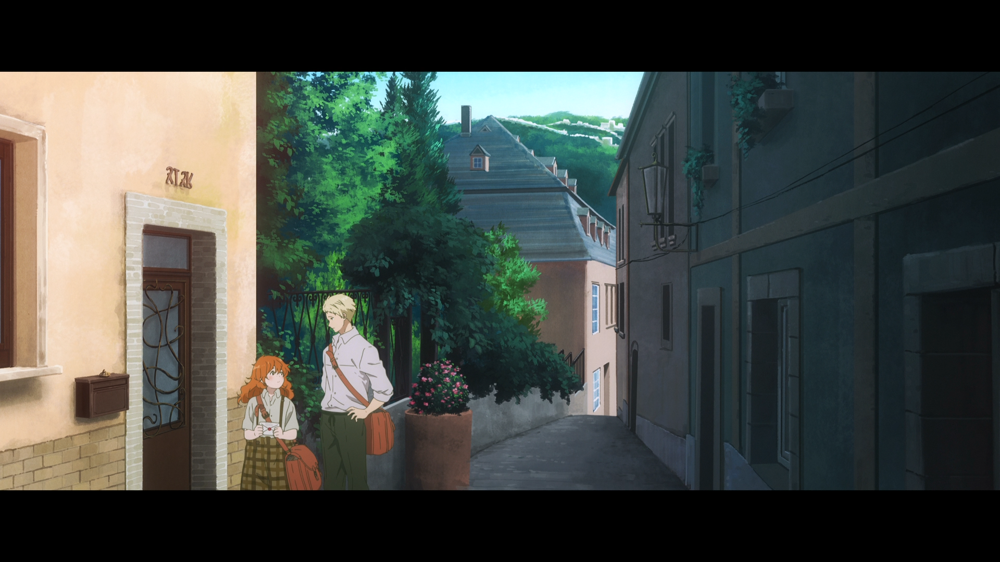
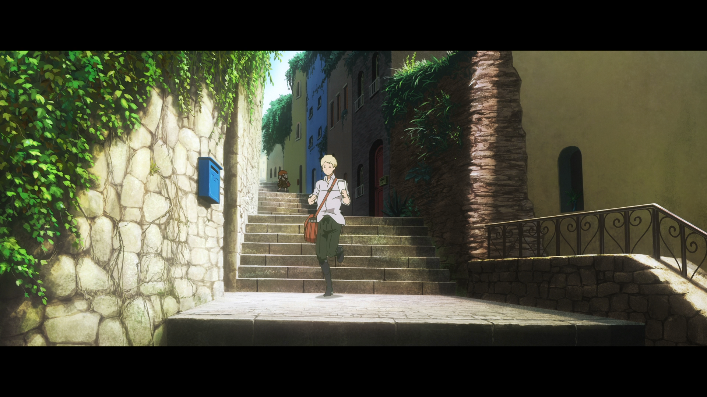
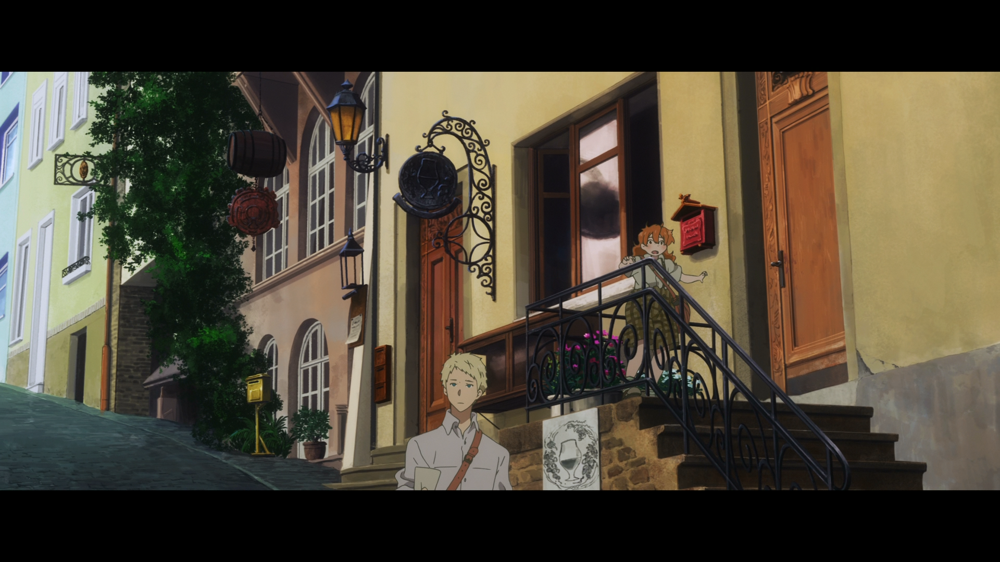
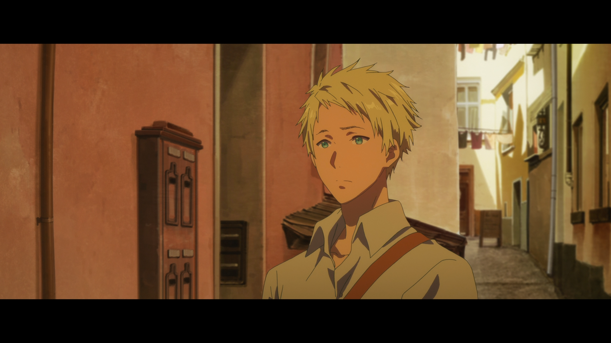
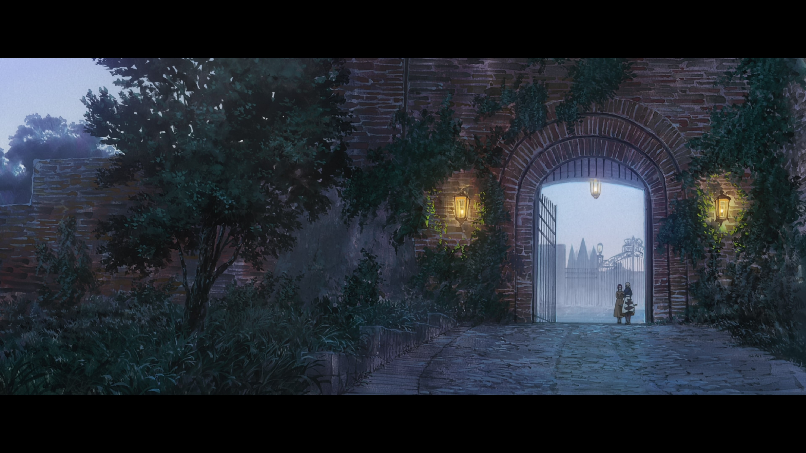
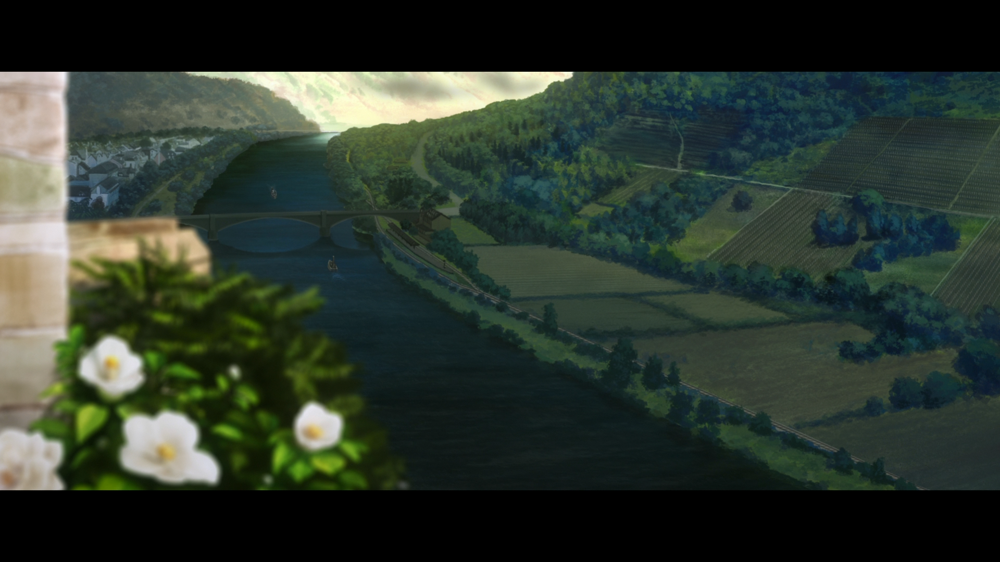
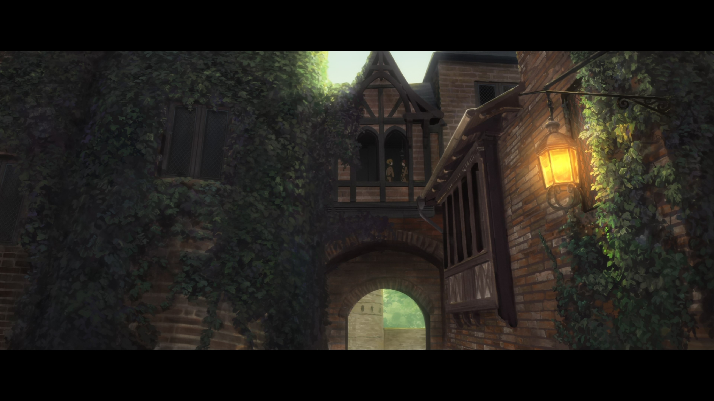
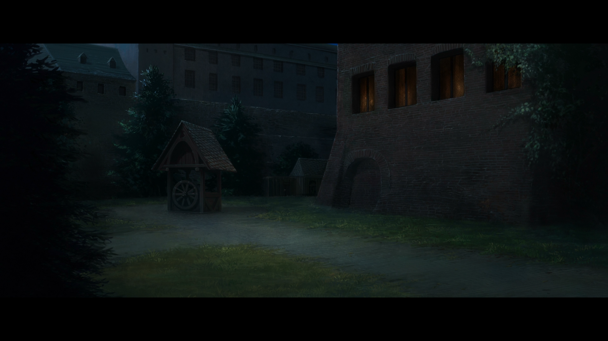
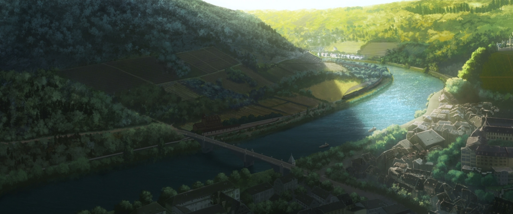
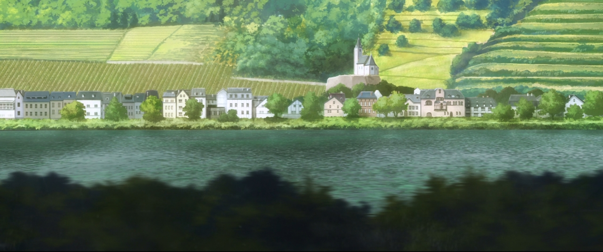

+++
title = "TODO"
description = ""
tags = [
  "Anime",
  "Anime Tourism"
]
date = 2025-01-14
+++

## Heidelberg

It is a pointed cone-like building that you can see below.
It seems that the angle will be the same if you take a photo from a place called Dicker Turm.

## Mannheim

## Cochem

<https://www.google.com/maps/d/viewer?mid=1bQOd8C7ytKQkgwHvJaagajzM26VCMC9D>

Gaiden

Train - sit on the left side to see the Mosel river

### Obergasse

Cochem - Taylors first mail delivery - This stop on Taylors first tour is at Obergasse, next to a hotel called "Lohspeicher". The house looks a bit different in real life and is a private home. So please don't put anything in the actual mailboxes there.
Cochem - Taylors first mail delivery

Cochem - Taylors first mail delivery 2

Cochem - Taylors first mail delivery 3 - We found this similar looking mailbox at a nearby plaza, but maybe there are other similar mailboxes in Cochem

## Hinter Kempeln

Cochem - Staircases - On Taylor's first tour with Benedict both of them run down those stairs. The area looks a bit different in real-life though.

Cochem - Taylors first mail delivery 2

### Alte Gutsschänke

### Branntweingässchen

Cochem - Branntweingässchen - The last stop of Benedict's and Taylor's tour is only a few steps away from her first mail delivery in real-life.

### Castle

 Cochem Castle - Outer Gate - The Gate matches what is shown in the Animation, but area on the left side is different. Additional cuts: 00:38:40ff

### Pinnerkreuz

 Cochem - Pinnerkreuz - One of the cuts from the beginning of the movie when Violet is traveling to the school (~00:02:28). To get up here, you can either use Cochem ropeway ("Cochemer Sesselbahn", 6,90€ roundtrip) or walk up the hill for aprox. 15-20min.

Cochem - Uferstraße - View of the castle in real life, sourounding is different. You need to cross the bridge to get this shot.

### Hatzenport - St. Johannes

Hatzenport - St. Johannes - View along the Mosel river as Violet travels to the school. This location is not in Cochem and takes a 10~15min drive by car to get there.

## Nuremberg

---

- <https://www.j-junk.de/violet-evergarden-gaiden-real-life-locations-in-germany/>
