+++
title = "Visiting the Ōigawa inspired by Yuru Camp Season 3"
description = "A day trip algong the beautiful valley of the river Ōi with the Ōigawa Railway"
tags = ["Anime", "Anime Tourism", "Yuru Camp", "Japan"]
date = 2024-12-30
dateContent = 2024-06-14
+++

## Introduction

I have been a fan of Yuru Camp since the first season, and I was very excited when the third season was announced. It was releasing while I was in Japan and easily reacheable from my location in Tsu by local and express trains. So I decided to visit the Ōigawa Railway and the surrounding area.

It took a while to get this blog post up, but I actually visited the spots fairly soon after the anime aired (less than two months after the release of episode 3, the episode that features the locations I visited). I hope you enjoy the pictures and the little trip report.

## The Plan

Since it is a pretty remote area trains are not very frequent, I had to plan my trip carefully. I checked the train and bus schedules and made a plan for the day so I wouldn't end up stranded.

Starting from my Hotel in Hamamatsu I took the train to Kanaya at 6:23 AM  wher I changed to the Ōigawa Railway.
Due to typhoon damage in 2022 the train was not running all the way to Senzu, so I had to get off at Ieyama at 7:49 AM and took the community bus to Senzu at 8:15 AM.

From there I took the train to Sessokyō Onsen, where I arrived at 10:28 AM.

The train ride itself was already very scenic and I could see the beautiful valley of the river Ōi. The announcer in the train also pointed out some of the sights along the way. Unfortunately I could not understand much due to the train noise.

From there I took the *Yappashi Komichi Love Romance Road* as seen in the anime and walked back all the way to Abt-Ichishiro Station to enjoy the sights along the way and then catch the train back to Senzu.

With that let's get to the pictures:

---



---

## Yappashi Komichi Love Romance Road






































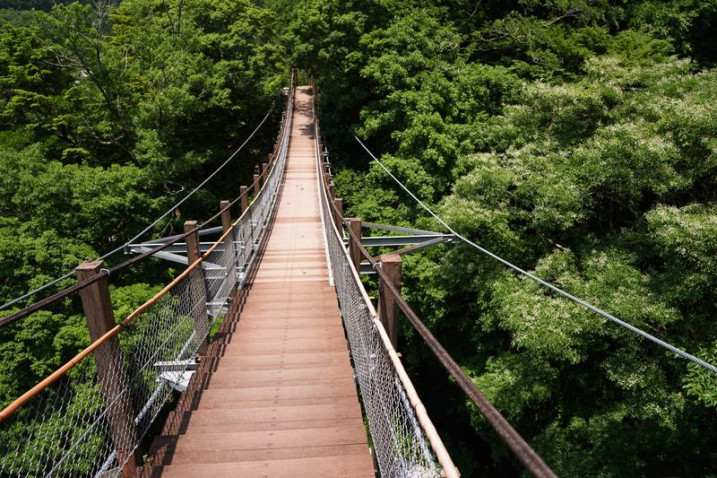


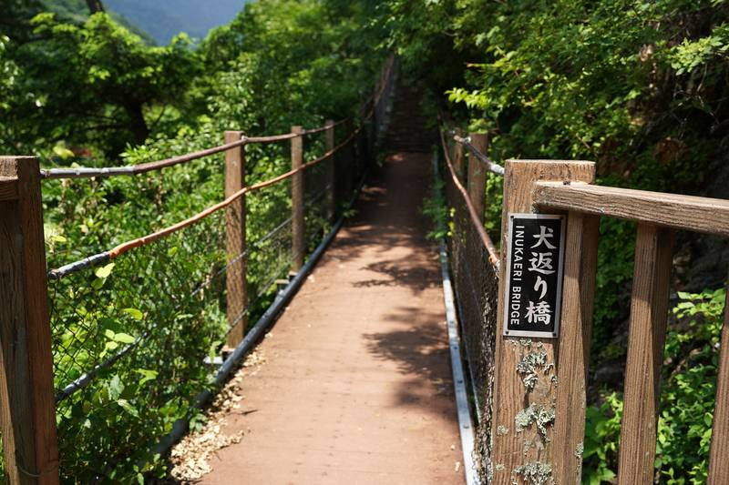


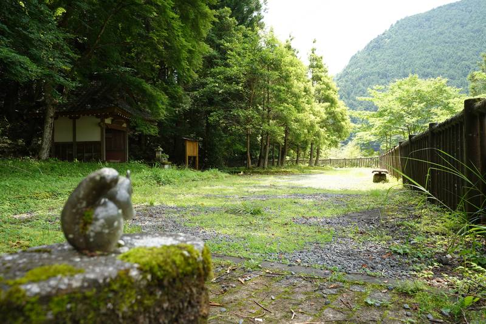

## Oku Ōi Kojō

## Nagashima Dam

Walk to nagashima dam
Nagashima Kouen














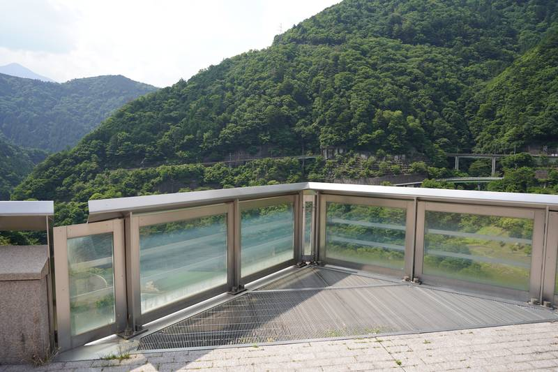


## Abt-Ichishiro

Abt Ichishiro (abt system), campground tunnel


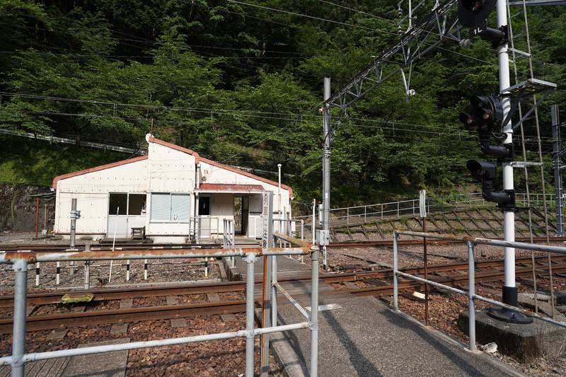


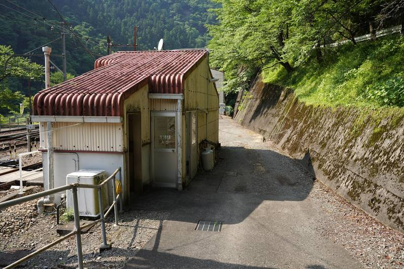


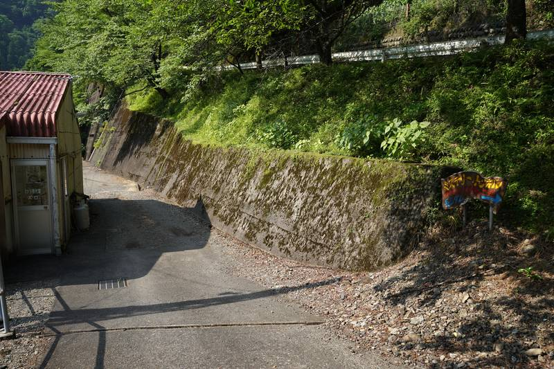


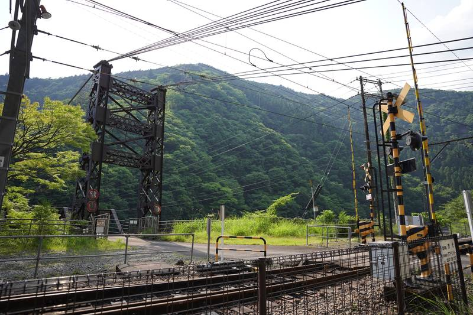


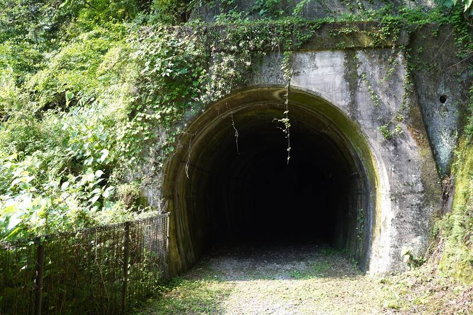


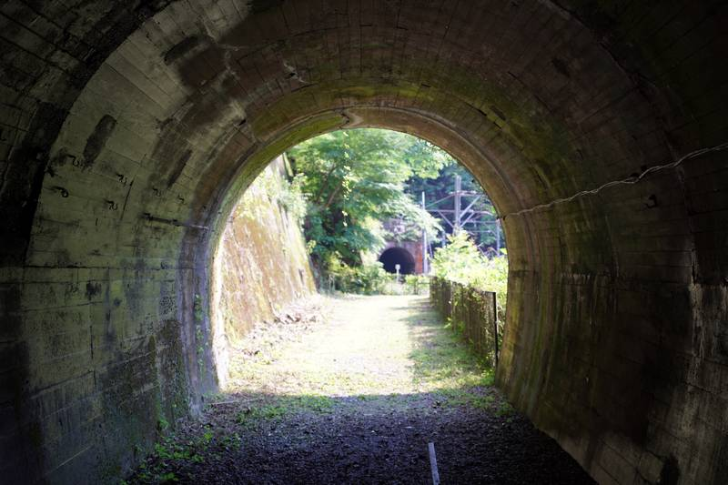


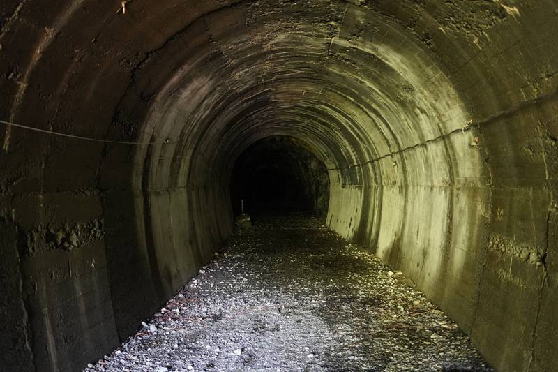


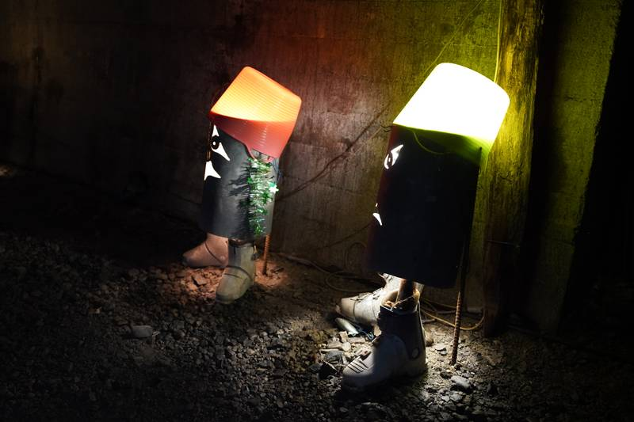







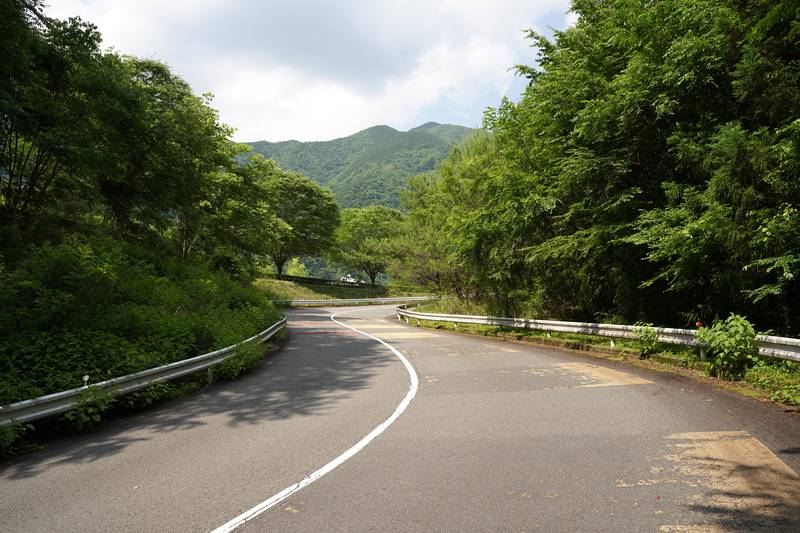

---

## Senzu


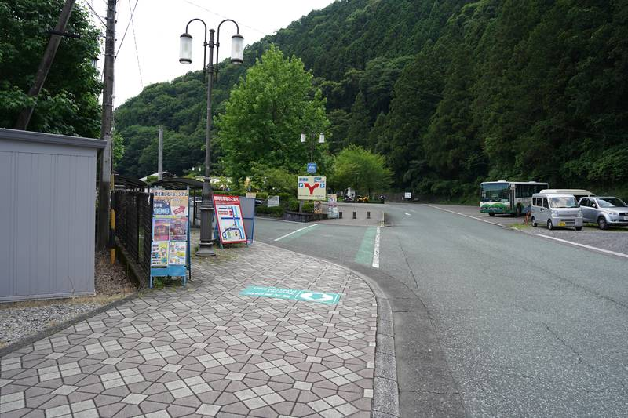

Date: 2024-06-14

I can't fly so this is the best I could do.

Sadly I couldn't try the Dam Curry as it was only available from 11:00 to 16:00 and I was there too early and too late.

























--- 

train





### Ryōgoku Tsuribashi

This suspension bridge can be visited with a short walk from Senzu Station. I had just enough time to visit it before my train back to Ieyama.



## Afterword

I had a great time visiting the locations from Yuru Camp Season 3 and I can only recommend it to other fans of the series. The area is very beautiful and the train ride is already worth it. Ideally you should plan for a night at one of the Onsen in the area to fully enjoy the experience or you can come with a car or motorbike and camp at Abt Ichishiro Campinground for a more Yuru Camp like experience.  
I hope you enjoyed this little trip report and maybe it will inspire you to visit the area yourself.
If I have the chance I would love to visit the Ōigawa again and maybe stay a night at one of the Onsen.
