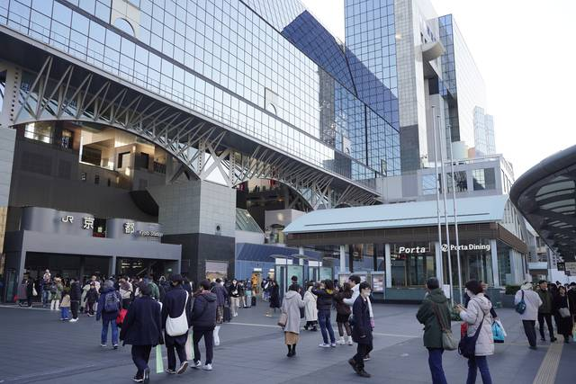
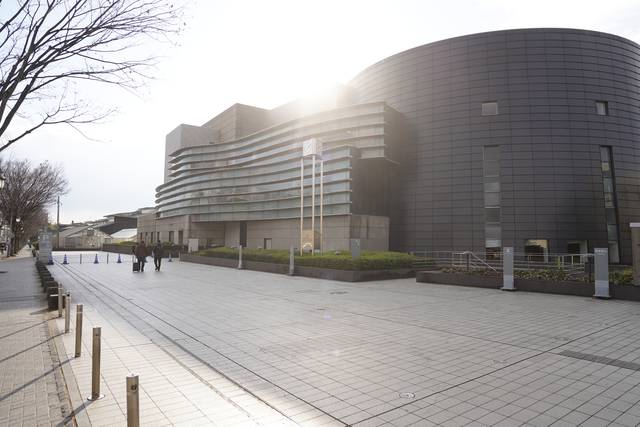
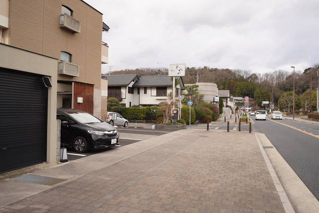
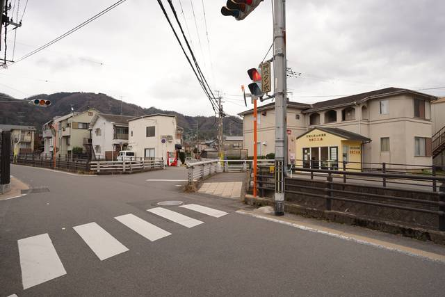
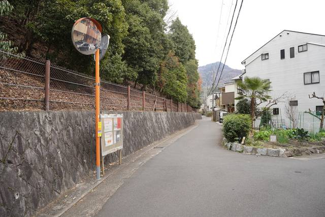
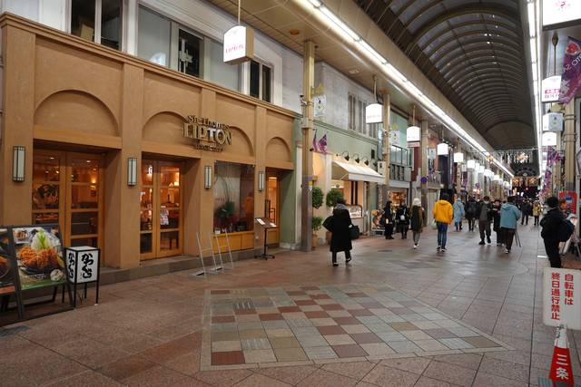
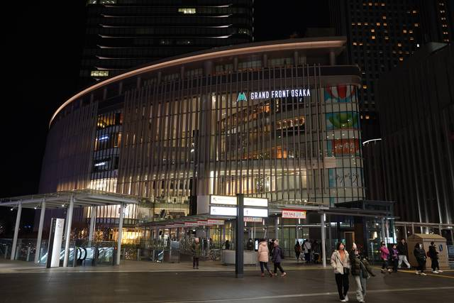
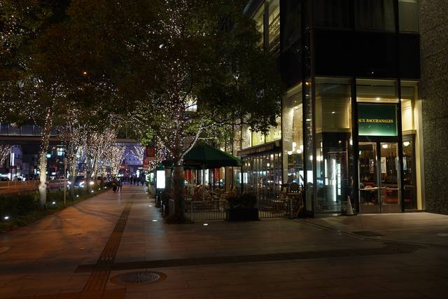

+++
title = "Visiting Places from Sanoba Witch (Sabbat of the Witch)"
description = ""
tags = [
  "Visual Novels",
  "Anime Tourism",
  "Sacred Place Pilgrimage",
  "Japan",
  "Yuzusoft",
]
date = 2024-03-06
+++

Welcome back to another pilgrimage! This time, I visited places from the Yuzusoft visual novels Senren*Banka (released in 2016) and Sanoba Witch (released in 2018). Since the two visual novels settings take inspiration from Kyōto, I visited them together. This is the page for Sanoba Witch. You can find the [Senren*Banka Pilgrimage by following this link](../tourism-senren-banka).

I recommend getting the bus day ticket and starting early if you want to tour it in one day, especially in winter, as the sun sets quite early. A bicycle could also come in handy to reach some of the places from Sanoba Witch.

Kyōto tourist spots are pretty but crowded
outside of the tourist spots, it's pretty quiet but also much less pretty.

---

## Kyoto Station

Date: 2023-12-24

## Kyoto Concert Hall

This images is used as the school in the visual novel, however, in reality it is the Kyoto Concert Hall.

Date: 2023-12-27

Date: 2023-12-27

Date: 2023-12-27

Date: 2023-12-27

## Sir Thomas Lipton - Sanjo Main Shop

Date: 2023-12-27

This was the last place on my Yuzusoft pilgrimage in Kyoto, so I ended the day by enjoying some Tsukemen (dipping noodles) at Tsurukame nearby, as suggested by gaogaogao on their Hatena Blog.

## Grand Front Osaka

Date: 2023-12-26

Date: 2023-12-26

Due to circumstances outside of my control, I arrived at the Grand Front Osaka in the late evening and everything was already closed so I had to return another day to take the picture inside the building.

Date: 2024-03-11

## Starbucks in Kobe

Date: 2024-03-11

Date: 2024-03-11

While Senren*Banka has a more traditional visual novel and shows more traditional and beautiful places in Kyoto, Sanoba Witch is more modern and I feel like it relies more on your imagination.
Visiting these places in the north east of Kyoto didn't leave the nicest impression of Kyoto, but I still enjoyed the pilgrimage. I hope you enjoyed it as well!

one. The visual novel was set in a city, and the places I visited were more modern as well. I hope you enjoyed this pilgrimage as well!

---

If you haven't already, now is the perfect time to check out the [Senren*Banka Pilgrimage](../tourism-senren-banka). Most of the places from there I would recommend anyone to visit, regardless of the visual novel.

---

Now that we're at the end, it's time to link others who have also made a similar pilgrimage.  
Special thanks to rinnow, gaogaogao and azusairi.  
(You can contact me if you want to be added to the list.)

- <https://rinnow.hatenablog.com/entry/sothewitch>
- <https://gaogaogao.hatenablog.com/entry/2018/09/03/105820>
- <https://azusairi.com/?p=2549>
- <https://azusairi.com/?p=2576>
- <http://seichidiary.blog.fc2.com/blog-entry-40.html>
