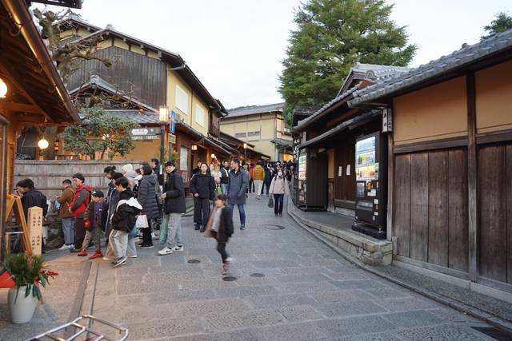
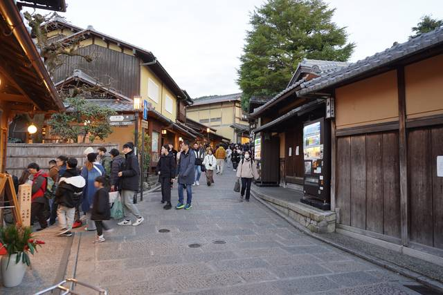
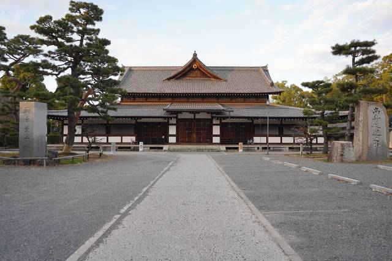
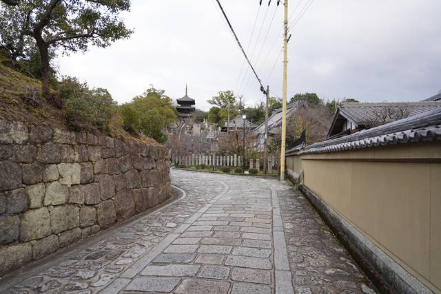
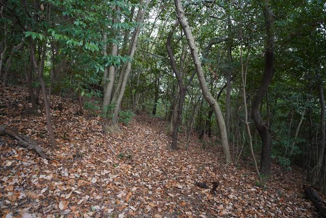
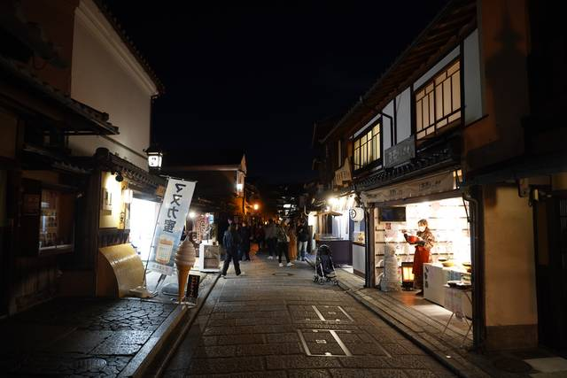
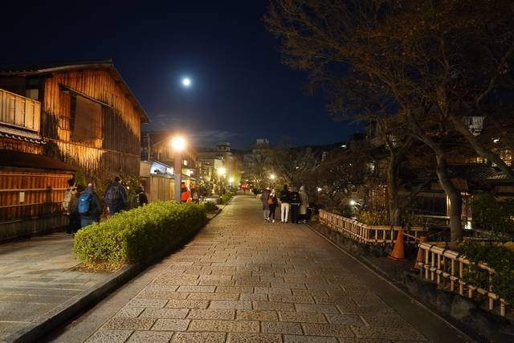
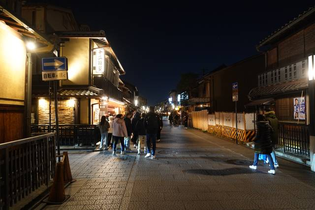
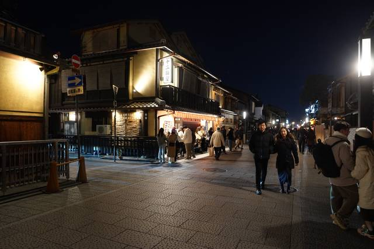
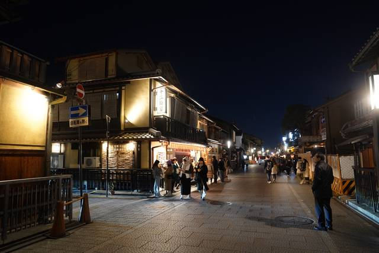

+++
title = "Visiting Places from Senren*Banka"
description = ""
tags = [
  "Visual Novels",
  "Anime Tourism",
  "Sacred Place Pilgrimage",
  "Japan",
  "Yuzusoft",
]
date = 2024-03-06
+++

Welcome back to another pilgrimage! This time, I visited places from the Yuzusoft visual novels Senren\*Banka (released in 2016) and Sanoba Witch (released in 2018). Since the two visual novels settings take inspiration from Kyōto, I visited them together. This is the page for Senren\*Banka. You can find the [Sanoba Witch Pilgrimage by following this link](../tourism-sanoba-witch).

Senren*Banka is set in an idyllic village untouched by modernization due to lying deep in the middle of the mountains. It boasts a traditional Japanese-style landscape and a hot spring resort attracting tourists.

While Kyoto isn't a hot spring town, it is a city that has preserved its traditional Japanese-style landscape thanks to being spared from large-scale destruction during World War II. The city is home to numerous temples, shrines, palaces, and gardens and is considered the cultural capital of Japan as well as a major tourist destination.

I recommend getting the bus day ticket and starting early if you want to tour it in one day, especially in winter, as the sun sets quite early.

## Sannenzaka and Ninenzaka

Date: 2023-12-27

Date: 2023-12-27

## Hanamikoji Street

## Shirakawa Lane

## Budo

Date: 2023-12-27

## Temple

Date: 2023-12-27

## Yoshidayama

Date: 2023-12-27

Sadly it had turned dark already, but I came back during Sakura season to take a new picture in daylight so now I have both a day and night picture.

Date: 2023-12-27

Date: 2023-12-27

Date: 2023-12-27

Date: 2023-12-27

Date: 2023-12-27

## Ikuta Shrine (Kobe)

In the visual novel, the shrine is called TODO. In real life, it's the Ikuta Shrine in Kobe, a shrine I would have wanted to visit anyway because they always have nice goshuin, goshuincho and omamori. It is the largest and most famous shrine in Kobe, and possibly among the oldest shrines in Japan.

Date: 2024-03-11

---

If you haven't already, now is the perfect time to check out the [Sanoba Witch Pilgrimage](../tourism-sanoba-witch).

---

Thanks to rinnow on Hatena Blog for the nicely 

Now that we're at the end, it's time to link others who have also made a similar pilgrimage.  
Special thanks to rinnow, gaogaogao and azusairi.  
(You can contact me if you want to be added to the list.)

- <https://rinnow.hatenablog.com/entry/senren>
- <https://gaogaogao.hatenablog.com/entry/2018/09/02/111931>
- <https://azusairi.com/?p=45>
- <https://azusairi.com/?p=158>
- <https://ameblo.jp/akaharaimorinoyuuutu/entry-12176592986.html>
- <http://explorers-station.teacake.net/explore/senren/senren.html>
- <https://ameblo.jp/yuki-mitoppo/entry-12203541732.html>
- <https://www.youtube.com/watch?v=iV-8C-ymIp4>
- <https://www.youtube.com/watch?v=oARwox6U104>
