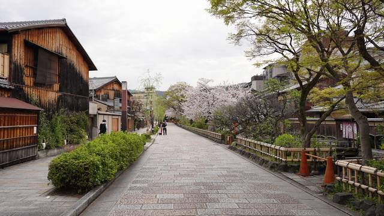
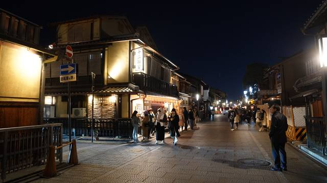
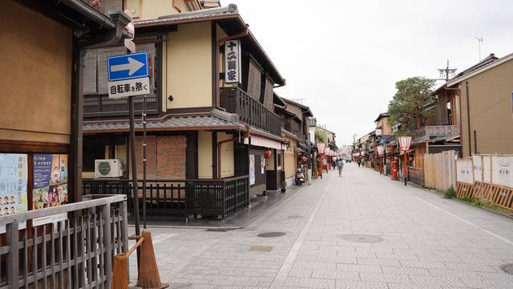
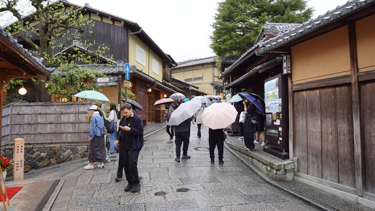
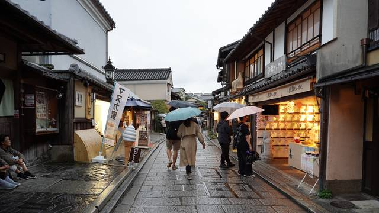
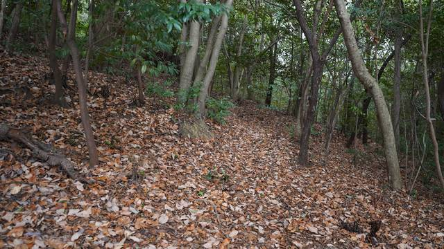
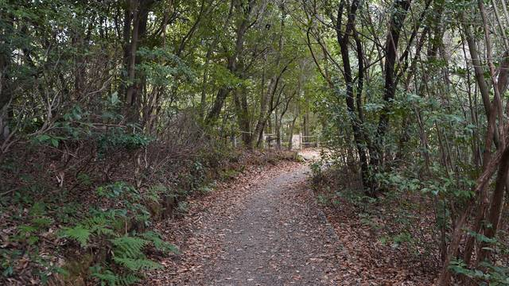
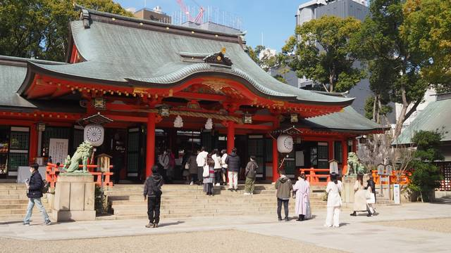

+++
title = "Visiting Places from Senren*Banka"
description = ""
tags = [
  "Visual Novels",
  "Anime Tourism",
  "Sacred Place Pilgrimage",
  "Japan",
  "Yuzusoft",
]
date = 2024-03-06
+++

Welcome back to another pilgrimage! This time, I visited places from the Yuzusoft visual novels Senren\*Banka (2016) and Sanoba Witch (2018). Since the two visual novels settings take inspiration from Kyōto, I visited them together. This is the page for Senren\*Banka. You can find the [Sanoba Witch Pilgrimage by following this link](../tourism-sanoba-witch).

---

Senren*Banka is set in an idyllic village untouched by modernization due to lying deep in the middle of the mountains. It boasts a traditional Japanese-style landscape and a hot spring resort attracting tourists.

While Kyoto isn't a hot spring town, it is a city that has preserved its traditional Japanese-style landscape thanks to being spared from large-scale destruction during World War II. The city is home to numerous temples, shrines, palaces, and gardens and is considered the cultural capital of Japan as well as a major tourist destination.

I recommend getting the bus day ticket and starting early if you want to tour it in one day, especially in winter, as the sun sets quite early.  
Now let's get started!

## Shirakawa Lane

A nice street along a small river just north of central Gion.
I have seen videos near the Gion Shinbashi bridge being full with tourists but it was fairly quiet every time I was there.

Date: 2023-12-27

I visited Kyōto again during the Sakura season and since I was already in the area I took a new picture in the morning.

Date: 2024-04-08

## Hanamikoji Street

Hanamikoji Street is one of Kyoto City's most famous streets, situated right in the Gion district.  
Since it is a public street you can take pictures, but be careful not to disturb anybody and do not take pictures anywhere it is not allowed.

Date: 2023-12-27

Date: 2024-04-08

## Sannenzaka and Ninenzaka

Nice shopping streets with traditional Japanese-style buildings in front of Kiyomizu-dera but also a lot of tourists.
Especially the stairs on the left side of the picture are very popular.
Sadly, the famous weeping cherry tree there suddenly fell down recently.

Date: 2023-12-27

Date: 2024-04-08

Date: 2023-12-27

Date: 2024-04-08

It had turned dark by the time I reached Ninenzaka, but I came back during Sakura season to take a new picture in daylight so now I have both a day and night picture.
The people at the shop on the right side were doing their best to sell their soap so I bought some after waiting for the right time to take a picture without people blocking the view.

## Budō Center (Former Butoku Hall)

The Former Butoku Hall is apparently the oldest martial arts performance hall in Japan, having been built in 1899 as part of the 1100th anniversary celebrations of the capital moving to Heian-kyo, and it has been designated as a significant cultural property in Japan.

Date: 2023-12-27

## Konkai Kōmyō-ji

A big and fairly quiet temple thats pretty unknown to tourists. It is one of the head temples of the Pure Land (Jōdo) school of Buddhism
and has a garden you can visit during the autumn leaves season.

Date: 2023-12-27

## Yoshidayama

A small mountain in the eastern part of Kyōto. Sadly the view of the city is mostly blocked by trees.
The Takenaka Inari Shrine next to it is somewhat famous for its cherry blossoms.

If you go down from the top (north west of the observation deck), it is close to the second 立入禁止 (no tresspassing) sign.

This location is south of the observation deck.

Date: 2023-12-27

If you come from Imadegawa Dori in the north, take the left path and keep your eyes open. Then you should find the first spot shortly before you reach the observation deck.
Continue straight, passing the observation deck, and you should find the second spot.

## Ikuta Shrine (Kōbe)

In the visual novel, the shrine is called Tatemi Jinja (建実神社). In real life, it's the Ikuta Shrine in Kōbe, a shrine I had already wanted to visit for their nice goshuin, goshuincho and omamori.
It is the largest and most famous shrine in Kōbe, and possibly among the oldest shrines in Japan.

Date: 2024-03-11

And that's it for my Senren\*Banka pilgrimage! I hope you enjoyed it as much as I did.

One place I still need to visit is "THE GARDEN PLACE SOSHUEN" in Kōbe which is the image used for the inn owned by Masaomi's grandfather in the visual novel.

---

If you haven't already, now is the perfect time to check out the [Sanoba Witch Pilgrimage](../tourism-sanoba-witch).

---

Now that we're at the end, it's time to link others who have also made a similar pilgrimage.  
Special thanks to rinnow, gaogaogao and azusairi.  
Feel free to contact me if you made the pilgrimage too and want to be added to the list.

- <https://rinnow.hatenablog.com/entry/senren>
- <https://gaogaogao.hatenablog.com/entry/2018/09/02/111931>
- <https://azusairi.com/?p=45>
- <https://azusairi.com/?p=158>
- <https://ameblo.jp/akaharaimorinoyuuutu/entry-12176592986.html>
- <http://explorers-station.teacake.net/explore/senren/senren.html>
- <https://ameblo.jp/yuki-mitoppo/entry-12203541732.html>
- <https://www.youtube.com/watch?v=iV-8C-ymIp4>
- <https://www.youtube.com/watch?v=oARwox6U104>
