+++
title = "Visiting Places from Tsukihime"
description = ""
tags = [
  "Visual Novels",
  "Anime Tourism",
  "Sacred Place Pilgrimage",
  "Japan",
]
date = 2023-11-25
+++

## Introduction

Tsukihime is a Japanese visual novel created by Type-Moon, who first released it at the Winter Comiket in December 2000.  
It is set in the fictional Misaki Town, located on the outskirts of the Kantō region. However, the actual backgrounds are edited photos from Tokyo, and most places can still be visited more than 20 years later.
As a big fan of Tsukihime, I decided to visit some of the places and take photos.

(In the Tsukihime Remake series, Misaki Town is replaced with Souya, which has photos of some different locations in Tokyo. I will not be covering Tsukihime Remake, as I have not read it yet.)

## Hibiya Park

I first visited Hibiya Park during the day, and the next day I went there again at night.

### The Fountain

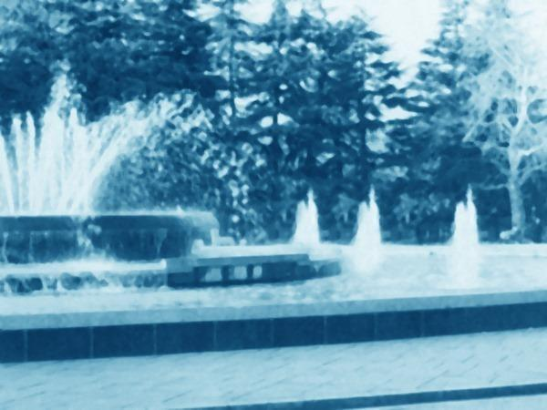
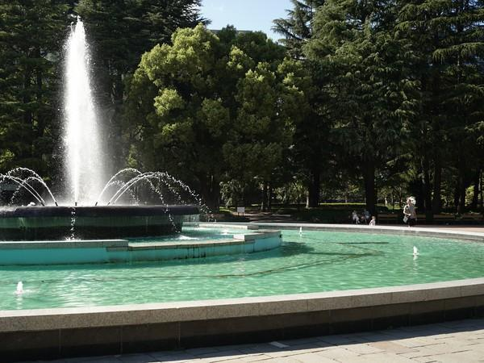
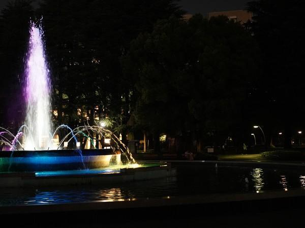

I assume that the image in Tsukihime was taken during the day, but I think it looked better at night.
The fountain jets have probably been replaced, so it looks a bit different.
Due to the fountain jets being higher, I took the photo further upward than the one in Tsukihime.
Maybe, with the right timing, it would be possible to get a photo more similar to the one in Tsukihime.  
Also, I have no clue from which angle the photo was taken, as the trees obviously look different now.

Here is a short video: <https://photos.google.com/share/AF1QipNmrFuproa0wQsEfc7w8rKn28urgPjKw22ODQvSwSBkQTR7vQBLFqiXcVZBPUKUfg/photo/AF1QipOrgg7LRwcx9fnnXLbOrzReKxqQn7XMgIoO4Qso?key=M0t3YUNoRTZsZkJkZ0RGY3piblZDZWd1ejdMYlZn>

## The path with the trees

There was construction going on, so the view of the trees was blocked. The original photo was probably taken in the winter, seeing as the trees are bare.
So even if there had been no construction, it would not have looked the same. (When I came back in winter the construction was still ongoing, so I didn't take another photo.)

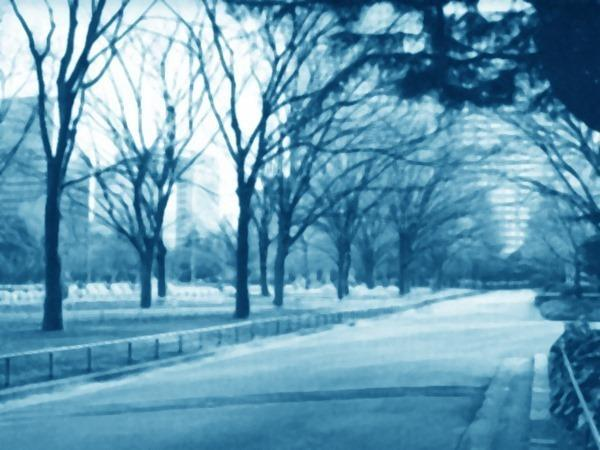
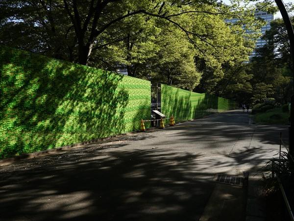

The path leads to Hibiya Public Hall:

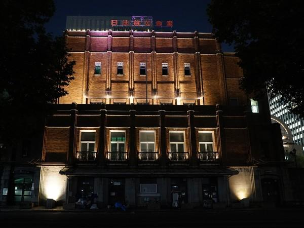

Afterward, I walked to the Sukiyaba Crossing in Ginza.

## The Sukiyabashi Crossing in Ginza

A short walk from Hibiya Park is the Sukiyabashi Crossing in Ginza, right next to Yurakucho.

It looks nice at night, with the big Fujiya signboard and the other lights shining brightly but not overwhelmingly.

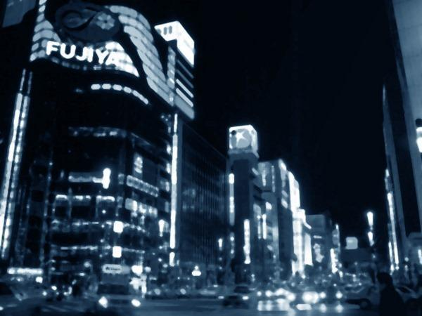
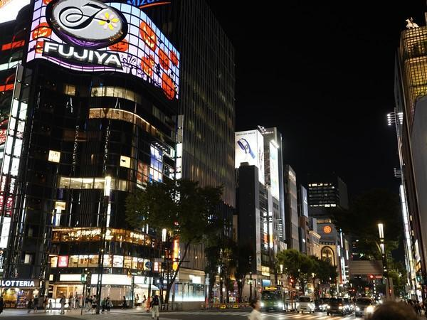
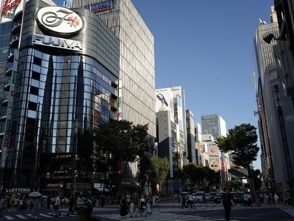

## Shibuya Modi (previously Shibuya Marui)

The Shibuya Marui has turned into the Shibuya Modi. It is a department store located close to the Shibuya Station.
The shape of the pillars has changed, and they are now covered in plants, but the building is still recognizable.

With the cars and the people, it was hard to get the photo. Also, the rounded shape makes it difficult to find the right angle, but I think I got close enough.

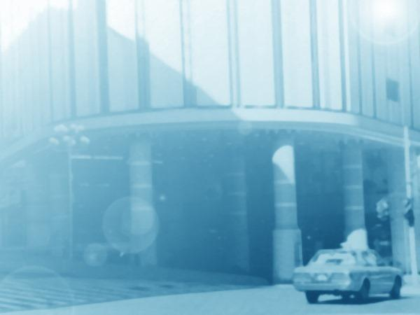
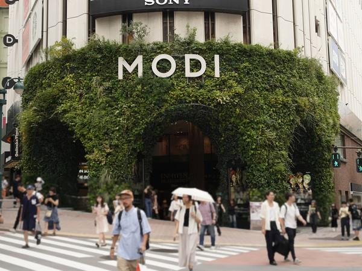

## School

Added: 2023-12-22

When I was in Tokyo again and had some time left, I decided to visit the school too.
It is located in Nerima so the train journey took a bit of time, and I had to walk a little.

Afterwards, I walked a little bit through Hikarigaoka, a quiet and beautiful residential area with lots of greenery as well as numerous and vast parks.

### School Gate

This is the entrance gate. It seems like the metal gate was completely opened when the picture in Tsukihime was taken, and it was probably taken from a slightly different position with a longer focal length.
Despite this I got quite close to the original image.  
It's crazy how it has stayed almost the same all these years.

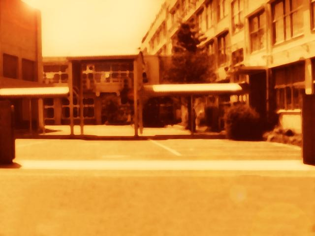
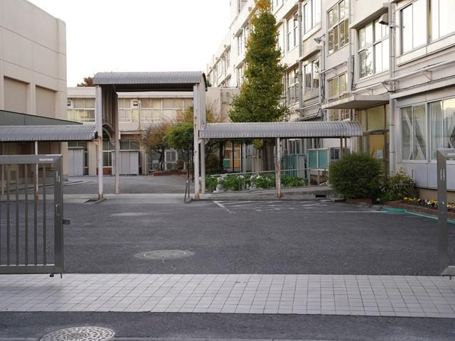

### Side of School

The original picture was probably taken from inside the school, but you can also see the similarity from outside.
This was the only angle where you could see the pillars even a little, as the hedge has gotten quite thick.
(My image is mirrored to be closer to the original, even though it is a different place and perspective.)

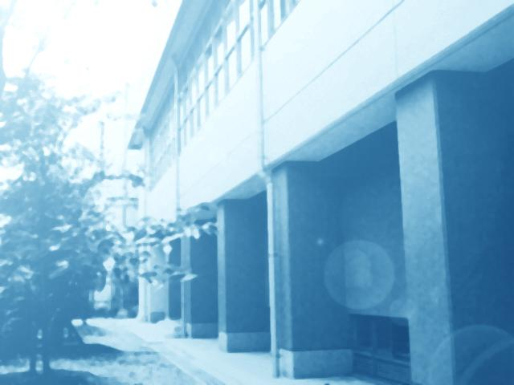
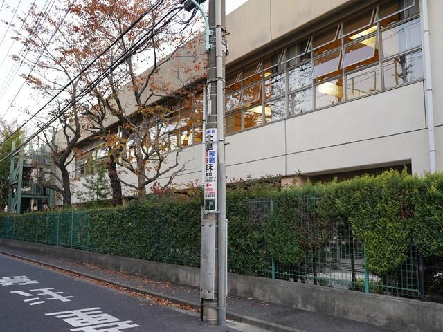

### School Courtyard

I didn't enter the school, so I had to take this picture from behind the net.
Every time I look at this image and think back, it feels kind of unreal that I've been to Shiki's school.

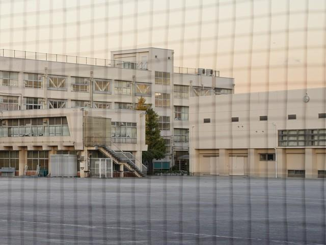

Here is a less cropped image:

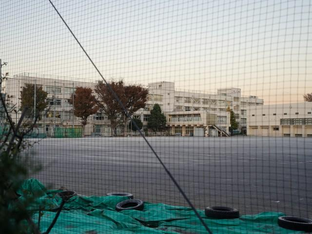

# Restaurant Shangri-La

Added: 2023-12-22

This is a Nepalese/Indian restaurant called Shangri-La in Kamata.

I was in Kawasaki for the Hakurei Shrine Uta Matsuri, so I decided to eat dinner at Shangri-La as I was already in the area.  
I got Chicken and Shnangri-La Special Nan. It was very delicous and the store owner was very friendly.
As it was late in the evening, nobody was there besides me.

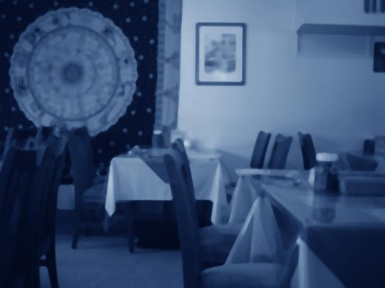
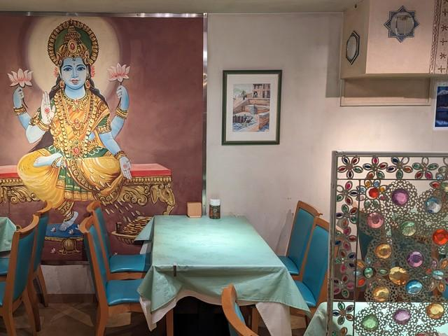

## Bonus 1: The Arc de Triomphe in Paris

These bonus images appear when Shiki dreams about the past of Roa's seventeenth incarnation.

I went to Paris in August 2016 with my family and, of course, visited the Arc de Triomphe too. I didn't take a photo from the same angle as the one in Tsukihime.

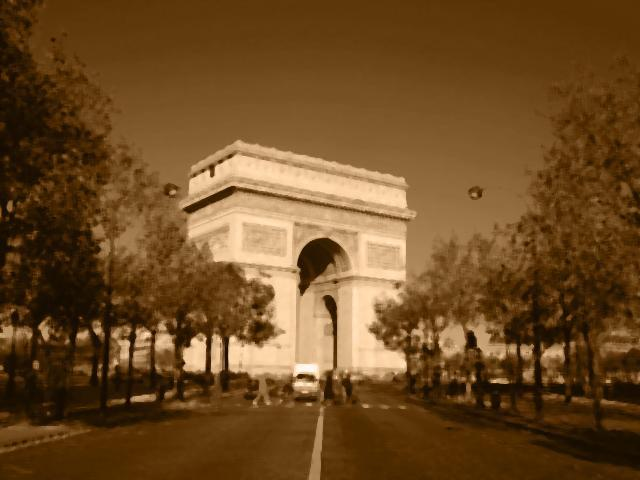
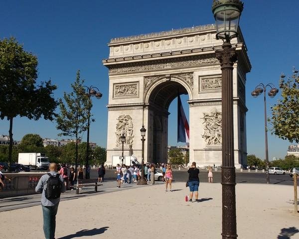

## Bonus 2: The Trevi Fountain in Rome

In July 2019, I went to Rome as part of a school trip. It was very crowded around the fountain, so I couldn't get any closer.

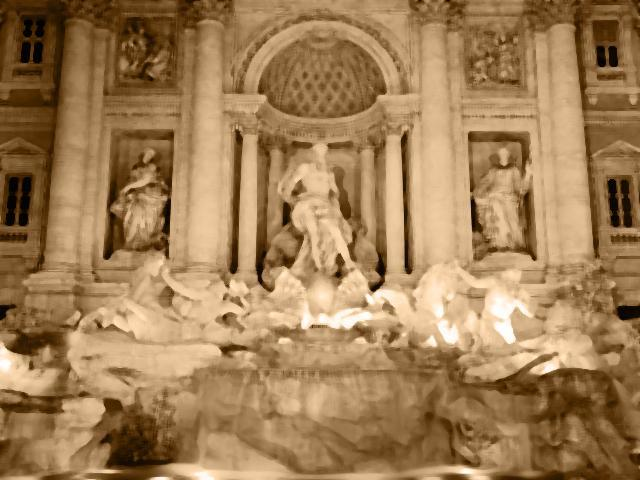
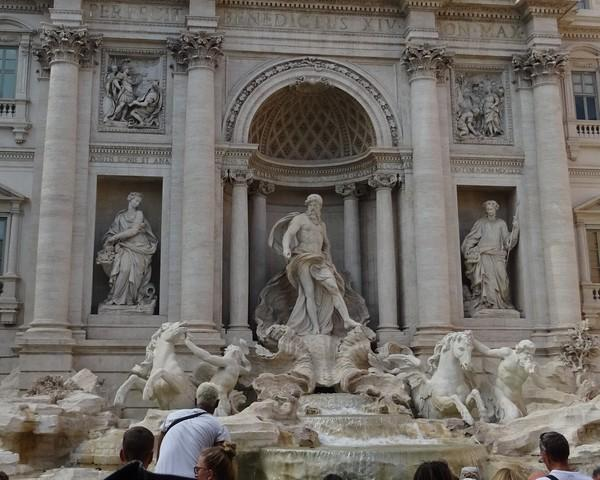

## Afterword

It was a lot of fun to visit these places.  
Sadly, the Shinjuku Suitomo Building has been renovated, so the place where the battle with Nero took place is now completely different.
Hibiya Park, where a lot of the images of the park in Tsukihime were taken, was pretty close to my hotel and has become one of my favorite parks in Tokyo.

When I'm in Kyoto, I plan to visit some places from Senren*Banka next.  
Look forward to another blog post about that!

## Acknowledgments

Thanks to 職業:魔法使い死亡 for their very comprehensive blog post on places from Tsukihime (in Japanese):  
<https://dtman.info/seichijunrei-butaitanbou-tsukihime-shinjuku-ginza-hibiya-nakano-nerima-kamata-komae-koshigaya/>  
Check it out for more details, and check out their other posts as well!

Also, thanks to [The Spriters Resource](https://www.spriters-resource.com/) for providing easy access to the sprites.

---

Here are some other posts by people who have made a similar pilgrimage.  
(You can contact me if you want to be added to the list.)

- <http://blog.livedoor.jp/anglerpon/archives/1001913152.html>
- <https://ameblo.jp/pachuca33/entry-10045768084.html>
- <https://ajin-movie.com/tukihime-seitijyunrei/>

And here is one about Tsukihime Remake: <https://hayabusa8823.hatenablog.com/entry/2021/09/09/000000>
